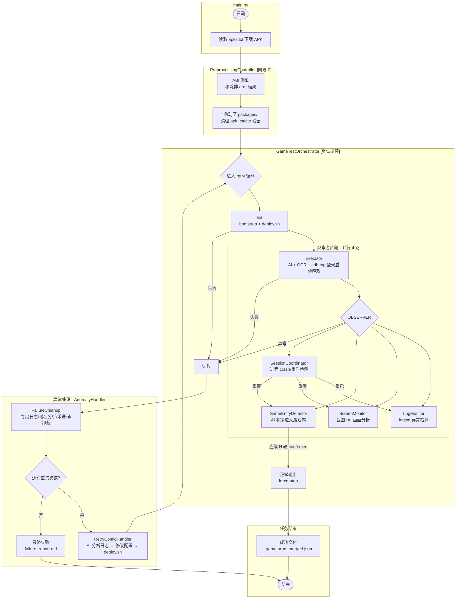
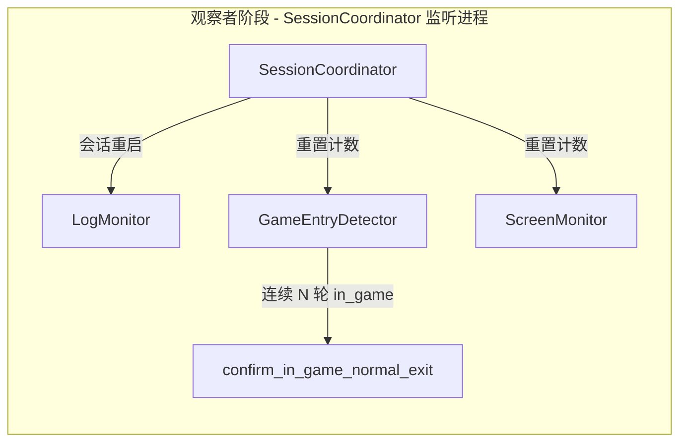

# android-ai-driven-test

基于 **MVC 架构**的 Android 游戏 + GameTurbo 网络加速自动化测试框架。核心为 **`game_agent`**（Pydantic-AI + ADB + PaddleOCR + 多模态），在设备/模拟器上完成从 APK 预处理到网络加速验证的完整闭环。

项目采用 **MVC（Model-View-Controller）架构**：

| 层 | 目录 | 职责 |
|---|------|------|
| **Controller** | `controllers/` | 编排控制逻辑，每个 Controller 对应一个流水线阶段 |
| **Model** | `models/` | Pydantic 数据模型 |
| **Service** | `services/` | 业务实现（ADB / LLM / deploy / 日志） |
| **Module** | `modules/` | 模块内纯逻辑（AI Agent 定义、预处理、重试策略、会话状态） |
| **View** | `views/` | 控制台输出 |

---

## 流水线总览



### 阶段总览

| 阶段 | Controller | 说明 | 是否参与重试 |
|------|-----------|------|-------------|
| **0** — 预处理 | `PreprocessingController` | 从 `apks.txt` 下载 APK → ABI 剥离 → 移至 `packages/`，清理 `apk_cache/` | **否**，仅执行一次 |
| **1** — Init | `GameTestOrchestrator` 内部 | GameTurbo 配置 → `deploy.sh` 打包安装 | 每轮 |
| **2** — 执行者 | `ExecutorFlowController` | 纯 AI：按通用登录阶段（隐私/公告/登录/选服等）OCR+tap；`skills/game-launch-ocr`；`pidof` 判定进程 | 每轮 |
| **3** — 观察者 | `GameEntryDetector` / `LogMonitor` / `ScreenMonitor` / `SessionCoordinator` | 并行监控（日志/画面/进游戏判定/crash） | 每轮 |
| **4** — 失败收尾 | `AnomalyHandler` → `FailureCleanup` | 导出日志、域名分析、杀进程、卸载游戏 | 每轮失败 |
| **5** — 修改重试 | `RetryConfigHandler` | AI 分析日志 → 修改配置 → `deploy.sh` → 下一轮 | `retry_on_failure: true` |

---

## 两层判定：开启游戏 vs 进入游戏内

| 判定 | 含义 | 实现 | 结束执行者？ |
|------|------|------|-------------|
| **开启游戏** | 游戏 APK 进程已拉起 | `adb pidof` / `pgrep`，`wait_for_game_running` | 是 |
| **进入游戏内** | 登录完成，处于游戏内场景（含强制新手引导蒙层） | 多模态 `VisionWorker` + OCR | 否（属观察者） |

**进入游戏内** 的否定项（OCR + 模型）：登录/选服/下载/创角（OCR 命中「创建角色」等硬排除）、纯加载页。
**肯定项**：游戏内 3D/HUD；有全屏新手引导蒙层仍算已进入。

确认进入游戏后调用 **`confirm_in_game_normal_exit`**：标记状态 → 等待 `game.normal_exit_observe_s`（默认 10s，观察加速）→ `force-stop` 游戏。

### 执行者：通用登录链（无 per-game 脚本）

多款游戏 UI 不同，但阶段类似。主脑每轮归类阶段（`splash` / `privacy` / `announcement` / `login` / `server_select` / `download` 等），按 OCR 坐标点击；细则见 [skills/game-launch-ocr/SKILL.md](skills/game-launch-ocr/SKILL.md)。Agent 可调用 `read_login_flow_guide` 读取全文。成功仅要求游戏进程出现，进入游戏内主场景由观察者判定。

---

## 观察者子系统



### SessionCoordinator（crash / 快速重启）

- 轮询 `game.session_poll_interval_s`，进程连续缺失 ≥ `game.session_absent_threshold_s` 后再现 → **会话重启**（同轮继续，默认不判失败）。
- 可选：`pid` 变化也触发重启。
- 重启动作：归档当前 `gameturbo.log` → `gameturbo_session_NNN.log`；`logcat -c`；清空并重新采集 **gameturbo.log**；重置进入游戏确认计数、下载卡住计数等。
- `game.max_session_restarts > 0` 时超限才中止观察者。
- 正常退出后不再监听 crash。

### GameEntryDetector

- 定时截图 + OCR + `llm_multimodal`；连续 `main_screen_confirm_rounds` 轮且 `confidence ≥ main_screen_min_confidence` 则进入游戏。
- 截图命名：`entry_detect_s{session}_{round}.png`。

### LogMonitor / ScreenMonitor

- **LogMonitor**：`logcat -s GameTurbo` → 追加 **gameturbo.log**；匹配 tunnel closed 等异常即失败。
- **ScreenMonitor**：定时截图多模态；下载进度卡住、错误文案等；与会话重启时重置卡住计数。

---

## 目录约定

### apk_cache 目录

路径：`apk_cache/`

| 文件 | 说明 |
|------|------|
| `apks.txt` | **APK 下载链接列表**，每行一个 URL，支持 `#` 注释 |
| `*.apk` | 下载或手动放置的原始 APK |

预处理阶段工作流：

1. 读取 `apk_cache/apks.txt` 中的第一个有效 URL
2. 下载 APK 到 `apk_cache/`
3. 检查 `lib/` 目录，移除非 `arm64-v8a` / `armeabi-v7a` 的 ABI 条目（仅 ZIP 条目过滤，不解压重压）
4. 将处理后的 APK **移动**至 `packages/`
5. 若 ABI 剥离产生了新文件，删除 `apk_cache/` 中的**原始 APK**，保持缓存目录干净

> **注意**：APK 是从 `apk_cache/` 移动到 `packages/` 的（不是复制），处理完成后 `apk_cache/` 中不应残留 APK 文件。

### packages 目录

路径：`GameTurbo-Native/client/android/packages/`

| 状态 | 目录内容 |
|------|----------|
| **初始化前** | **仅 1 个**原包 APK（文件名前缀为 `gid`） |
| **`deploy.sh` 之后** | 原包 + `game_gameturbo.apk` + 签名文件 |
| **每轮尝试结束（仍重试）** | 删除 `game_gameturbo*`，**保留原包** |
| **任务最终结束** | 再删除原包 APK |

---

## 任务产出（run_outputs）

目录：`gameturbo.run_outputs_dir`（默认 `./run_outputs/{gid}_{task_id}/`）。

**成功：**

| 文件 | 说明 |
|------|------|
| `gameturbo_{gid}_test.json` | 从 `GameTurbo-Native/.gameturbo_merged.json` 复制 |
| `result.json` | 含 `merged_config`、`session_restarts` 等 |

**失败：**

| 文件 | 说明 |
|------|------|
| `failure_report.md` / `failure_report.json` | AI 汇总诊断 |
| `failure_summary.md` | 简要失败摘要 |
| `result.json` | 元数据 |

过程数据：`agent.artifacts_dir/retry_{N}_{时间戳}/`。

---

## GameTurbo 日志

| 项 | 说明 |
|----|------|
| 主文件名 | 始终 **gameturbo.log** |
| 采集 | 观察者 bootstrap；运行中 logcat 流追加；结束 `finalize` 补设备缓冲 |
| 会话归档 | crash 前内容复制为 `gameturbo_session_NNN.log`，活跃文件仍为 gameturbo.log |
| 去重 | 按行首 logcat 时间戳 |
| 域名分析 | `domain_region_analysis.json` |
| 基线技能 | [skills/gameturbo-log-baseline/SKILL.md](skills/gameturbo-log-baseline/SKILL.md) |

---

## 快速开始：从零到运行

### 第一步：环境准备

| 依赖 | 要求 | 验证方法 |
|------|------|---------|
| Python | **≥ 3.12, < 3.13** | `python --version` |
| ADB | 已加入 PATH | `adb --version` |
| aapt | Android SDK build-tools | `aapt dump badging` |
| Git Bash | Windows 下运行 `deploy.sh` 用 | `git --version` |
| LLM API Key | DeepSeek + 多模态模型 | 见下方 API 配置 |
| PaddleOCR | pip 安装 | 自动 |

```bash
# 安装 Python 依赖
pip install -e .
```

### 第二步：GameTurbo-Native 适配（仅首次）

该项目依赖网络加速 SDK 仓库 `GameTurbo-Native/`，首次使用需要手动准备：

```bash
# 1. 创建 packages 目录
mkdir -p GameTurbo-Native/client/android/packages

# 2. 放置签名文件（从管理员处获取或自行生成）
#    将 test.jks 放到 GameTurbo-Native/client/android/

# 3. 修改 deploy.sh
#    编辑 GameTurbo-Native/client/android/deploy.sh
#    注释掉第 4 部分的所有内容（热更新配置和启动逻辑）
#    （第 4 部分在大约 228-235 行）
#    原因是原项目的热更新逻辑不适用于此测试框架，返回错误会导致 AI 误判

# 4. 向管理员获取 check_target_stability.py
#    放置到 GameTurbo-Native/ 目录下
#    （原 SDK 未附带此文件，但对域名分析至关重要）

# 注意：
# - 原项目不支持 Windows，需先对 GameTurbo-Native/ 进行 Windows 适配
# - check_target_stability.py 同样需要 Windows 适配
# - deploy.sh、extract_domain_region_from_log.sh 等脚本需在 git-bash 中执行
```

### 第三步：配置 settings.yaml

复制配置模板并编辑：

```bash
cp config/settings.example.yaml config/settings.yaml
```

#### 必改项

```yaml
llm:
  base_url: "https://api.deepseek.com"
  api_key: "sk-你的key"           # ← 填写 DeepSeek API Key
  model_name: "deepseek-v4-flash"

llm_multimodal:
  base_url: "https://your-gateway/v1"
  api_key: "你的key"              # ← 填写多模态模型的 API Key
  model_name: "model/qwen3.6-plus" # ← 必填，支持视觉的模型

executor:
  post_launch_wait_s: 2.0       # am start 游戏后等待界面稳定
  ad_initial_wait_s: 3.0        # 疑似广告页初次等待
  max_foreground_retries: 4
```

#### 各配置段详解

**preprocessing — 预处理阶段（retry 循环前执行一次）：**

```yaml
preprocessing:
  enabled: true                # 启用预处理（APK 下载 + ABI 剥离）
  apk_cache_dir: "./apk_cache" # APK 缓存目录
  preserved_abis:              # 保留的 ABI（其他会被剥离）
    - "arm64-v8a"
    - "armeabi-v7a"
```

**game — 游戏进程与进入判定：**

```yaml
game:
  package_name: "com.xt.alsp35.x7sy"      # 游戏包名（APK 自动覆写后可留空）
  launch_activity: "com.cbdpsyb.cs.SplashActivity"  # 启动 Activity（自动覆写）
  timeout_s: 350.0                         # 观察者总超时
  launch_detect_timeout_s: 90.0            # 等待游戏进程启动超时
  launch_detect_poll_interval_s: 2.0       # 进程轮询间隔
  main_screen_detect_timeout_s: 240.0      # AI 等待进入游戏内超时
  main_screen_detect_poll_interval_s: 3.0  # 进入判定截图间隔
  main_screen_confirm_rounds: 2            # 连续确认轮数
  main_screen_min_confidence: 0.75         # 最低置信度
  normal_exit_observe_s: 10.0             # 进入游戏后等待观察秒数
  session_poll_interval_s: 0.8            # crash 检测轮询间隔
  session_absent_threshold_s: 0.8         # 进程消失多久视为 crash
  clear_logcat_on_session_restart: true    # crash 后清空 logcat
  max_session_restarts: 0                 # 0=不限制 crash 重启次数
```

**gameturbo — GameTurbo 上下文（由框架自动填充，通常无需手动配置）：**

```yaml
gameturbo:
  gid: ""                       # 原包文件名前缀解析出的游戏 gid（自动）
  game_config_path: null        # 当前轮次可修改的配置 JSON 路径（自动）
  source_apk: null              # 发现的原始游戏 APK 路径（自动）
  deploy_timeout_s: 900.0       # deploy.sh 最长等待时间
  run_outputs_dir: "./run_outputs"  # 任务产出根目录
```

**modules — 模块开关：**

```yaml
modules:
  executor: true               # OCR + AI + adb tap 执行者阶段
  game_entry_detect: true      # AI 进入游戏判定 + 正常退出
  log_monitor: true            # GameTurbo 日志监控
  screen_monitor: true         # 画面异常检测
  retry_on_failure: false      # 失败后是否重试
  max_retries: 3               # 最大重试次数（retry_on_failure=true 时有效）
```

**agent — AI Agent 行为参数：**

```yaml
agent:
  max_rounds: 30                        # 执行者最大操作轮数
  artifacts_dir: "./artifacts"          # 过程数据存储目录
  persist_learned_skill_on_success: true  # 成功后自动总结技能到 experiences/
  tap_observe_count: 2                  # tap_and_observe 默认连拍 OCR 次数
```

**logging — 日志与审计：**

```yaml
logging:
  level: "INFO"                     # 日志级别
  enable_run_audit: true            # 写入 audit/（事件、AI 轨迹）
  enable_process_log_file: true     # 写入 process.log
  enable_pipeline_trace: true       # 写入 pipeline_trace.jsonl
```

**其他配置：**

```yaml
adb:
  serial: null                 # 指定设备序列号（null=自动选择）

credentials:
  file_path: "./credentials.yaml"  # 游戏账号凭证文件
```

> `game.package_name` 和 `game.launch_activity` 会在 `game_gameturbo.apk` 存在时由 aapt 自动覆写，可留空。

### 第四步：准备 APK 下载链接

在项目根目录创建 `apk_cache/` 目录，放入 `apks.txt`：

```bash
mkdir -p apk_cache

# 写入 APK 下载直链（每行一个，支持 # 注释）
echo "https://cdn.example.com/game_1.2.3.apk" > apk_cache/apks.txt

# 也可以手动放入 APK 文件到 apk_cache/（会跳过下载，直接进行 ABI 剥离）
```

预处理阶段会自动：
1. 读取 `apk_cache/apks.txt` 取第一个有效 URL 下载
2. 检查 `lib/` 目录，移除非 `arm64-v8a`/`armeabi-v7a` 的框架（仅 ZIP 过滤，不解压重压）
3. 移动处理后的 APK 到 `packages/`，并清理 `apk_cache/` 中的原始文件

### 第五步：运行

```bash
# 推荐方式（通过 run.sh 启动，自动处理环境变量）
./run.sh

# 或直接 Python 启动（需手动 unset SSL_CERT_FILE）
unset SSL_CERT_FILE
python -m game_agent.main

# 仅测试 LLM 连通性
python test.py
python test.py --vision   # 额外测试多模态看图
```

#### 运行过程

启动后，程序会依次输出各阶段日志：

```
2026-05-28 10:00:00 INFO game_agent.orchestrator: 任务产出目录: run_outputs/16173_20260528_100000 (gid=16173)
2026-05-28 10:00:00 INFO controllers.pre_controller: 阶段 0 [预处理]: APK 下载/ABI 剥离
2026-05-28 10:00:30 INFO preprocessing.assets_preparer: APK 下载完成: game_1.2.3.apk (120.5 MB)
2026-05-28 10:00:35 INFO preprocessing.preprocessor: ABI 剥离完成: .game_1.2.3_stripped.apk
2026-05-28 10:00:36 INFO preprocessing.preprocessor: APK 已移动到: GameTurbo-Native/client/android/packages/game_1.2.3.apk
2026-05-28 10:00:36 INFO preprocessing.preprocessor: 已清理 apk_cache 中的原始 APK: game_1.2.3.apk
2026-05-28 10:00:36 INFO controllers.orchestrator: === 开始流程 第 1/1 次尝试 ===
2026-05-28 10:00:36 INFO controllers.orchestrator: GameTurbo Init: gid=16173 config=... created=True
...
```

#### 退出码含义

| 退出码 | 含义 | 产出 |
|--------|------|------|
| **0** | 全部通过 | `run_outputs/{gid}_{task_id}/gameturbo_{gid}_test.json` |
| **1** | 失败（耗尽重试或不可恢复） | `run_outputs/{gid}_{task_id}/failure_report.md` |
| **2** | 配置文件错误 | 控制台报错详情 |

#### 日志产出

```
artifacts/retry_1_20260528_100000/
├── process.log                  # Python 日志
├── pipeline_trace.jsonl         # 流水线调用追踪
├── audit/                       # AI 审计
│   ├── events.jsonl
│   └── ai_trace.md
├── executor/                    # 执行者阶段截图
├── entry_detect_s0_*.png        # 进入游戏判定截图
├── gameturbo.log                # GameTurbo 日志
├── gameturbo_session_*.log      # crash 归档日志
├── domain_region_analysis.json  # 域名区域分析
└── attempt_failure_report.md    # 本轮失败报告（失败时）
```

---

## 架构：目录结构

### game_agent/ 核心包

```
game_agent/
├── main.py                          # CLI 入口
├── paths.py                         # 全局路径常量（REPO_ROOT、APK_CACHE_DIR 等）
├── __init__.py / __main__.py        # 包声明与入口
│
├── config/                          # 配置加载
│   └── loader.py                    # YAML + ${ENV} 展开 → AppConfig
│
├── controllers/                     # C: 编排控制（流水线阶段）
│   ├── orchestrator.py              # GameTestOrchestrator — 主编排 + retry 循环
│   ├── pre_controller.py            # PreprocessingController — 预处理（下载+ABI剥离）
│   ├── executor_controller.py       # ExecutorFlowController — OCR+AI 执行者
│   ├── game_entry_controller.py     # GameEntryDetector — 进入游戏判定
│   ├── session_controller.py        # SessionCoordinator — 进程 crash/重启监控
│   ├── log_monitor_controller.py    # LogMonitor — 日志异常监控
│   ├── screen_monitor_controller.py # ScreenMonitor — 画面异常检测
│   └── retry_controller.py          # AnomalyHandler — 异常处理+重试入口
│
├── models/                          # M: Pydantic 数据模型
│   ├── settings.py                  # 全量配置（AppConfig + 各子段模型）
│   ├── run_state.py                 # RunState — 跨轮次运行时状态
│   ├── pipeline_phase.py            # PipelinePhase — 流水线阶段枚举
│   ├── game_entry_judgment.py       # GameEntryJudgment — 进入游戏判定结果
│   ├── gameturbo_config.py          # GameTurboConfigPatch — AI 配置修改补丁
│   ├── failure_report.py            # 失败诊断报告模型（含 to_markdown()）
│   └── deploy_recovery.py           # deploy 失败 AI 恢复补丁模型
│
├── modules/                         # 纯业务逻辑（与 Controller 解耦）
│   ├── executor/
│   │   └── agent.py                 # Pydantic-AI Agent + OCR/tap 工具
│   ├── preprocessing/
│   │   ├── preprocessor.py          # ABI 剥离 + packages 移动
│   │   └── assets_preparer.py       # APK 下载（apks.txt → httpx）
│   ├── retry/
│   │   ├── analysis.py              # AnalysisAgent — AI 根因分析与配置补丁
│   │   ├── deploy_retry.py          # deploy 失败 AI 重试
│   │   ├── cleanup.py               # FailureCleanup — 失败收尾（日志+卸载）
│   │   └── retry_config.py          # RetryConfigHandler — 配置修改+重新 deploy
│   └── observer_session/
│       └── state.py                 # ObserverSessionState — 共享会话状态
│
├── services/                        # 基础设施服务
│   ├── adb_service.py               # AdbService — ADB 命令封装（截图/点击/启动等）
│   ├── llm_service.py               # LLM 模型工厂（build_llm_model）
│   ├── llm_adapters/                # LLM 适配器
│   │   ├── base.py                  # 抽象基类
│   │   ├── deepseek.py              # DeepSeek 专有（thinking 模式）
│   │   ├── openai.py                # 通用 OpenAI 兼容
│   │   └── qwen.py                  # Qwen 多模态
│   ├── llm_transcript.py            # LLM 消息格式化（控制台输出）
│   ├── vision_probe.py              # 多模态启动探针
│   ├── deploy_runner.py             # deploy.sh 调用（Git Bash）
│   ├── game_launch.py               # 游戏进程检测（pidof/pgrep）
│   ├── gameturbo_log.py             # logcat 采集/去重/归档
│   ├── normal_exit.py               # 正常退出流程（confirm + force-stop）
│   ├── failure_report.py            # AI 失败报告生成
│   ├── run_deliverable.py           # 成功/失败最终产出
│   ├── run_audit_log.py             # 审计日志（events.jsonl + ai_trace.md）
│   ├── pipeline_trace.py            # 流水线调用追踪
│   ├── session_memory.py            # Pydantic-AI 对话记忆持久化
│   ├── learned_skill_store.py       # AI 工具：读取已学技能
│   └── success_skill_summarizer.py  # 成功时为 AI 总结生成技能文档
│
├── agents/                          # 对外 Agent 导出（__init__.py）
│
├── utils/                           # 工具函数
│   ├── apk_util.py                  # aapt 提取包名/启动 Activity
│   ├── gameturbo_bootstrap.py       # GameTurbo 前置（gid 解析/配置发现/deploy 准备）
│   ├── gameturbo_config_apply.py    # 安全合并 AI 配置补丁到 games JSON
│   ├── gameturbo_log_domain_extract.py  # 域名/区域分析
│   ├── gameturbo_log_skill.py       # 日志基线技能加载
│   ├── ocr_util.py                  # PaddleOCR 封装（含 2.x/3.x 兼容）
│   ├── character_creation_ocr.py    # 创角 OCR 硬规则（23 个关键词排除）
│   ├── settings_yaml.py             # YAML 安全更新工具
│   ├── packages_cleanup.py          # packages/ 目录清理（deploy 产物+原包）
│   ├── target_stability.py          # 域名稳定性探测
│   └── tools/adb_tap.py             # CLI：adb input tap
│
├── workers/                         # 异步 Worker
│   └── vision_worker.py             # 多模态视觉分析 Worker
│
└── views/                           # 控制台输出
    └── console_view.py              # 格式化控制台文本
```

### 外围目录

```
config/                              # 项目配置文件
├── settings.yaml                    # 主配置（活跃）
├── settings.example.yaml            # 配置模板
├── credentials.yaml                 # 凭据文件
└── credentials.example.yaml

skills/                              # 人工编写的技能文档
├── gameturbo-log-baseline/SKILL.md  # 日志基线判定规则
└── game-launch-ocr/SKILL.md         # 执行者 OCR+tap 指引

experiences/                         # AI 自动总结的已学技能
└── agent_skills/                    # 每个成功 run 生成一个 skill_*.md

run_outputs/                         # 任务产出目录
├── {gid}_{task_id}/                 # 按 gid + 时间戳命名
│   ├── gameturbo_{gid}_test.json   # 成功：合并配置副本
│   ├── result.json                  # 运行元数据
│   ├── failure_report.md/json       # 失败：AI 诊断报告
│   └── failure_summary.md           # 失败：简要摘要

apk_cache/                           # APK 下载缓存
└── apks.txt                         # APK 下载链接（每行一个 URL）

GameTurbo-Native/                    # GameTurbo SDK（外部依赖）
├── .gameturbo_merged.json           # deploy 产出合并配置
├── games/                           # 游戏 JSON 配置
│   └── template.json                # 配置模板
├── client/android/
│   ├── deploy.sh                    # 打包部署脚本
│   └── packages/                    # APK 存放（原包 + game_gameturbo.apk）
├── extract_domain_region_from_log.sh
└── check_target_stability.py
```

---

## 感知与决策

- **OCR**：PaddleOCR（`ocr.model_profile`: mobile / server）。
- **主脑 LLM**：执行者阶段（`llm`）。
- **多模态 LLM**：`game_entry_detect`、`screen_monitor`（`llm_multimodal`）。
- **进入游戏判定**：独立 prompt；创角 OCR 硬规则见 `character_creation_ocr.py`。
- **技能**：`skills/game-launch-ocr`、`skills/gameturbo-log-baseline`；`experiences/agent_skills/` 存放成功 run 自动生成的摘要（可为空）。

---

## LLM 适配器

| 模块 | 作用 |
|------|------|
| [services/llm_service.py](game_agent/services/llm_service.py) | `build_llm_model` |
| [services/llm_adapters/](game_agent/services/llm_adapters/) | openai / deepseek / qwen |

`deepseek_litellm_compat: true` 用于不支持思考参数的网关。正式跑进入游戏判定需配置 `llm_multimodal`；`skip_vision_probe: true` 仅跳过启动探针，不关闭判定本身。

---

## 失败、重试与 Modify

**FailureCleanup：** finalize **gameturbo.log** → 域名分析 → force-stop → 卸载游戏。

**retry_on_failure: true：** AI 读日志/域名 JSON 补丁 `games/gameturbo_{gid}_*.json` → `deploy.sh`（更新 `.gameturbo_merged.json`）→ 下一轮从 executor 重跑。

Modify 改的是 `games/*.json`；**成功交付**固定为 deploy 合并后的 `.gameturbo_merged.json`。

---

## 常见问题

**Q：pidof 成功就算测试通过吗？**  
A：否。观察者还需 AI 确认进入游戏内，并在 `normal_exit_observe_s` 内无 log/screen 异常，才产出成功配置。

**Q：crash 后日志混在一起了怎么办？**  
A：SessionCoordinator 会归档旧段为 `gameturbo_session_*.log`，清空 logcat 后只往 **gameturbo.log** 写新会话。

**Q：游戏重启很快，会话能跟上吗？**  
A：调低 `session_absent_threshold_s`（如 0.8）与 `session_poll_interval_s`；进入游戏判定调低 `main_screen_detect_poll_interval_s`。

**Q：成功交付哪个 JSON？**  
A：`GameTurbo-Native/.gameturbo_merged.json` 的副本，不是 `games/gameturbo_{gid}_test.json`。

**Q：tunnel closed 算失败吗？**  
A：不一定，见 [gameturbo-log-baseline](skills/gameturbo-log-baseline/SKILL.md)。

**Q：怎么只测某一模块？**  
A：在 `modules` 中关闭其它项；测观察者前需先有游戏进程（executor 或手动启动）。

**Q：apk_cache 中的 APK 为什么处理完还在？**  
A：正常情况下预处理完成后 APK 已移动到 `packages/` 且原始文件会被清理。如果残留，请检查上一次运行的日志确认预处理阶段是否正常完成。

---

## 注意（补充说明）

- GameTurbo 仅支持 `arm64-v8a` 和 `armeabi-v7a` 两个框架，预处理阶段会自动清理 APK 中其他 ABI 的 so 文件
- 运行脚本需要在 **git-bash** 中执行（`deploy.sh`、`extract_domain_region_from_log.sh` 等依赖 bash 环境）
- 若使用模拟器，优先自动选中；可在配置中指定 `adb.serial`
