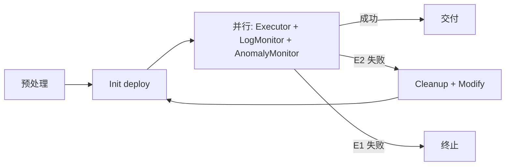

# android-ai-driven-test

Android 游戏 + GameTurbo 网络加速的自动化测试框架。在设备/模拟器上完成 APK 预处理、部署、AI 驱动登录进游戏、加速日志验证与失败重试。

## 架构

| 层 | 目录 | 职责 |
| --- | --- | --- |
| Controller | `game_agent/controllers/` | 流水线编排 |
| Model | `game_agent/models/` | Pydantic 配置与状态 |
| Service | `game_agent/services/` | ADB、LLM、deploy、日志 |
| Module | `game_agent/modules/` | Agent、预处理、重试 |
| View | `game_agent/views/` | 控制台输出 |

## 环境要求

| 依赖 | 要求 |
| --- | --- |
| Python | ≥ 3.12, < 3.13 |
| ADB / aapt | 已加入 PATH |
| Git Bash | Windows 下运行 `deploy.sh` |
| LLM | DeepSeek（主脑）+ 多模态视觉模型 |
| PaddleOCR / uiautomator2 | `pip install -e ".[dev]"` 安装 |

```bash
pip install -e ".[dev]"
```

## 首次部署

1. 创建 `GameTurbo-Native/client/android/packages/`，放置签名文件 `test.jks`。
2. 编辑 `GameTurbo-Native/client/android/deploy.sh`，注释第 4 部分（热更新逻辑，约 228–235 行）。
3. 向管理员获取 `GameTurbo-Native/check_target_stability.py`（需 Windows 适配）。
4. 复制配置：`cp config/settings.example.yaml config/settings.yaml`，填写 `llm`、`llm_multimodal` API Key。
5. 新设备执行一次：`python -m uiautomator2 init`。
6. 去GameTurbo-Native/games下面新建一个`template.json`文件，具体如下：
```json
{
    "_platform": "平台",
    "game_id": "填写游戏id",
    "config_version": 1,

    "default_action": "tunnel",
    "port_rules": [],
    "direct_patterns": [
    ]
}
```

完整配置项见 `config/settings.example.yaml`。`modules.executor: true` 或开启 `network_anomaly` 时 `llm_multimodal` 必填。

## 快速运行

```bash
mkdir -p apk_cache
echo "https://example.com/game.apk" > apk_cache/apks.txt   # 或直接放入 *.apk
./run.sh
# 或: unset SSL_CERT_FILE && python -m game_agent.main
```

| 退出码 | 含义 |
| --- | --- |
| 0 | 成功（须 `check_in_game` 确认） |
| 1 | 失败 |
| 2 | 配置错误 |
| 130 | 用户 Ctrl+C 中断 |

## 流水线



| 阶段 | 日志前缀 `[阶段]` | 说明 | 重试 |
| --- | --- | --- | --- |
| preprocess | `[preprocess]` | `apks.txt` 下载 / ABI 剥离 → `packages/` | 否 |
| init | `[init]` | GameTurbo 配置 + `deploy.sh` | 每轮 |
| orchestrator | `[orchestrator]` | 单次 attempt 编排外壳 | 每轮 |
| executor | `[executor]` | DFS 状态树登录 + `check_in_game`（与 observer 并行） | 每轮 |
| observer | `[observer]` | LogMonitor 仅采集；AnomalyMonitor OCR+多模态判网络异常 | 每轮 |
| cleanup | `[cleanup]` | 失败收尾：停游戏、导出日志、Python 域名分析、卸载 | 失败时 |
| modify | `[modify]` | AI 补丁配置 → deploy → 下一轮 | E2 且开启重试 |

阶段名与 `game_agent/models/pipeline_phase.py` 中 `PipelinePhase` 一致；`process.log` 与控制台每行自动带 `[阶段]` 前缀（由 `game_agent/utils/stage_logging.py` 注入）。

**成功条件：** 并行阶段无错误，且 `check_in_game` 连续确认（`deploy` 完成或 Modify 完成均不算成功）。

**运行期观测：** LogMonitor 只写入 `gameturbo.log`，不按日志规则判死。网络类异常由 AnomalyMonitor 轮询截图 OCR（网络弹窗、下载停滞等），再经多模态确认后 `signal_fatal`；登录/UI 失败在图内 recover，不走 region 重试。

**超时：** `game.timeout_s` 为防卡死保护；已确认进游戏后不会因 executor 收尾慢而判超时。

## 批跑

`main.py` 统一走批跑入口：`apks.txt` 每条 URL 一个任务，多设备从 `adb devices` 自动认领，忽略 `settings.yaml` 的 `adb.serial`。

- 产出：`run_outputs/{gid}_{task_id}/`
- 批汇总：`run_outputs/batch_{时间戳}/batch_manifest.json`
- 文件锁：`run_outputs/.task_queue.lock` 防止重复消费

## 目录约定

**apk_cache/** — `apks.txt`（每行一个 URL）或手动放入 `*.apk`。预处理后 APK **移动**至 `packages/`（非复制）。

**packages/**（`GameTurbo-Native/client/android/packages/`）— 单任务开始时清空；批跑按 gid 精准清理。deploy 后含原包 + `game_gameturbo.apk`。

**run_outputs/{gid}_{task_id}/**

| 成功 | 失败 |
| --- | --- |
| `.gameturbo_merged_{gid}.json` | `failure_report.md` |
| `result.json` | `failure_summary.md` |
| `final_logs.log` | `result.json`（含 error_code） |
| `logs/`、`reports/` | 同上 |

重试审计：`config_backups/`、`config_retry_journal.jsonl`、`attempts/retry_*/`。过程数据在 `artifacts/retry_*/`，任务结束后删除。

### 日志与阶段标记

每轮 attempt 在 `artifacts/retry_{n}_{时间戳}/` 写入过程日志（任务结束后归档到 `run_outputs/.../logs/`）：

| 文件 | 内容 |
| --- | --- |
| `process.log` | Python 框架全量日志；格式 `时间 [阶段] LEVEL logger: 消息` |
| `gameturbo.log` | 设备 GameTurbo logcat；阶段切换时插入 `# [STAGE:阶段] 说明` 分隔行 |
| `pipeline_trace.jsonl` | 结构化调用追踪；`process.log` 中对应 `[PIPELINE][阶段]` 行 |
| `anomaly_evidence.json` | 网络异常确认时的 OCR/多模态摘要与截图路径（供 Modify 引用） |
| `audit/events.jsonl` | AI 思考 / 工具 / 阶段事件（非全量日志） |

`final_logs.log` 按 attempt 内联 `process.log`、`gameturbo.log` 等，可直接按阶段检索：

```bash
grep '\[modify\]' run_outputs/*/final_logs.log
grep '\[STAGE:executor\]' run_outputs/*/logs/*/gameturbo.log
```

配置项（`config/settings.yaml` → `logging`）：`enable_process_log_file`、`enable_pipeline_trace`、`enable_run_audit`。

## 失败与重试

错误码定义见 `game_agent/models/run_failure.py`。

| 区间 | 含义 | 可重试 |
| --- | --- | --- |
| E1xxx | 配置/预处理/deploy/登录/UI/Modify 硬失败 | 否 |
| E2xxx | OCR+多模态确认的网络/加速类异常 | 是（`retry_on_failure`） |

E2 失败路径：停游戏 → Cleanup（日志归档 + Python `domain_region_analysis.json`）→ AI 最小补丁 → deploy → 下一轮。

Modify 硬终止（E1003 LLM 耗尽 / E1006 无可改或无变更）：不 deploy，不进入下一轮。

| 码 | 场景 |
| --- | --- |
| E1009 | deploy 后包未安装 |
| E1010 | 超时且未进游戏 |
| E2001 | logcat 断流等基础设施问题 |
| E2002 | OCR+多模态确认的网络画面异常 |
| E2004 | 路由/加速 |
| E2005 | 下载失败 |
| E2006 | 区服列表/选服异常 |

Modify 阶段 AI 参考 `domain_region_analysis.json`、`anomaly_evidence.json` 与 `gameturbo.log`（事后分析，运行期不读日志判死）。

`network_anomaly` 配置（见 `settings.example.yaml`）：`enabled`、`poll_interval_s`、`require_multimodal_confirm`（OCR suspect 后是否必须多模态确认）、`download_progress_stall_s`。

运行时 Skill：`skills/SKILL.md` → `game_launch_ocr_skill.md`（LangGraph 进游戏排障）、`gameturbo_log_baseline_skill.md`（Modify 决策树）。

## 项目结构

```
game_agent/
├── main.py                 # 入口
├── controllers/            # 编排：orchestrator, batch_runner, executor, log_monitor, retry
├── models/                 # 配置、错误码、任务上下文
├── modules/                # preprocessing, retry（Modify）
├── services/               # adb, llm, deploy, ocr, install_monitor
└── utils/                  # apk, gameturbo 配置, ocr, stage_logging

config/                     # settings.yaml, credentials.yaml
apk_cache/                  # APK 来源
skills/                     # 运行时参考文档
run_outputs/                # 任务产出
GameTurbo-Native/           # 加速 SDK（外部依赖）
tests/                      # pytest 单元测试
```

## 常见问题

**进程起来就算通过吗？** 否，须 `check_in_game` 确认。

**多设备怎么配？** 批跑自动使用全部在线设备，无需配 serial。

**deploy 很久无输出？** 大 APK inject 可能数分钟；控制台有 `[deploy]` 前缀实时日志。

**Ctrl+C？** 第一次优雅停止，第二次强制退出（130）。

**凭据填表？** 复制 `config/credentials.example.yaml` 为 `credentials.yaml`；登录由 `atomic_login` 节点一次完成：OCR 取坐标 → u2 填账号密码 → Enter，验收仅 OCR（黑屏则收键盘后再 OCR）。

## 测试

```bash
# 全量
python -m pytest tests/ -v

# 单个文件
python -m pytest tests/test_privacy_checkbox.py -v

# 单个用例
python -m pytest tests/test_privacy_checkbox.py::test_roi_mean_abs_diff_detects_checked_on_fixture -v

# 静态检查
ruff check game_agent tests
```

说明：
- 用 `python -m pytest` 即可，不依赖 PATH 里的 `pytest` 命令；`-v` 显示每个用例的通过/失败。
- 多数用例无需真机；checkbox 相关测试使用 `tests/img/before.png`、`after.png`、`after_2.png`，首次会加载 PaddleOCR，可能较慢。
