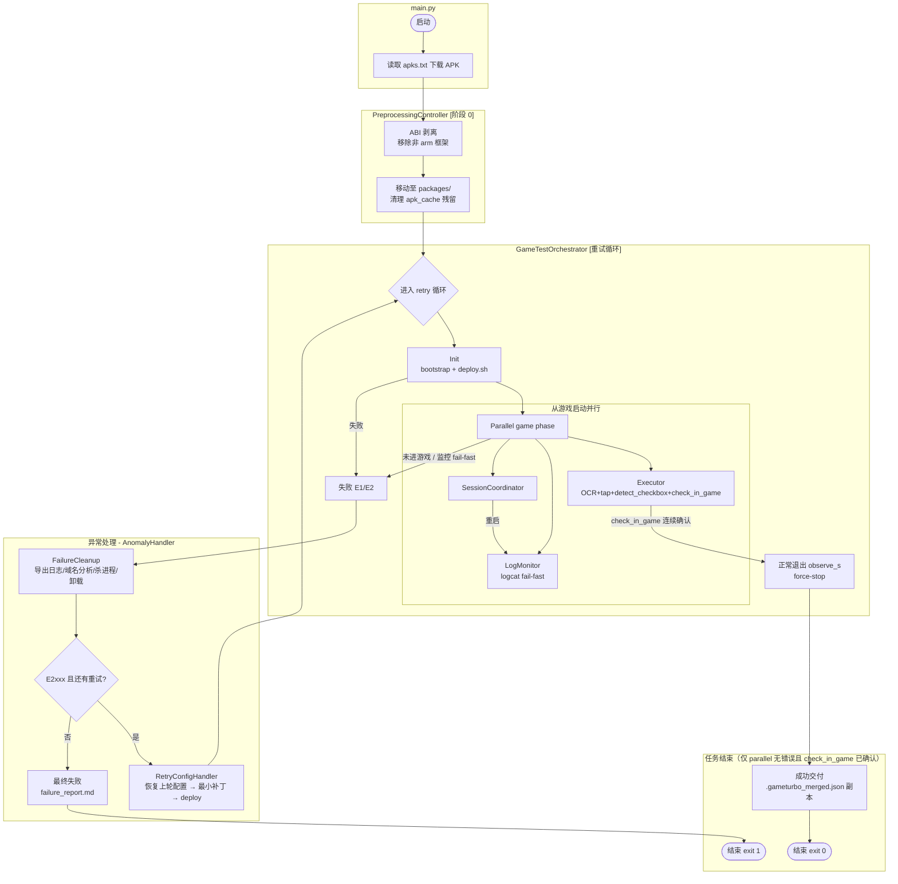
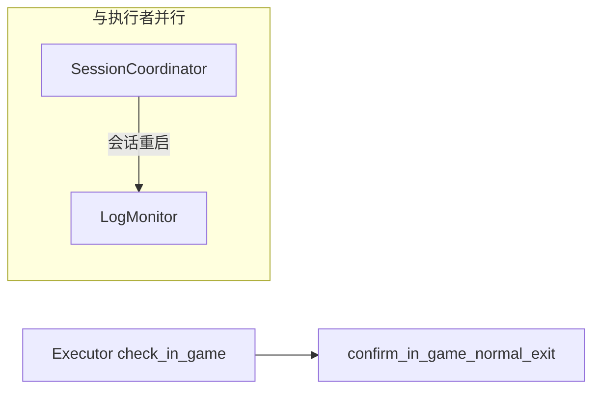

# android-ai-driven-test

基于 **MVC 架构**的 Android 游戏 + GameTurbo 网络加速自动化测试框架。核心为 **game_agent**（Pydantic-AI + ADB + PaddleOCR + 多模态），在设备/模拟器上完成从 APK 预处理到网络加速验证的完整闭环。

项目采用 **MVC（Model-View-Controller）架构**：


| 层              | 目录             | 职责                                |
| -------------- | -------------- | --------------------------------- |
| **Controller** | `controllers/` | 编排控制逻辑，每个 Controller 对应一个流水线阶段    |
| **Model**      | `models/`      | Pydantic 数据模型                     |
| **Service**    | `services/`    | 业务实现（ADB / LLM / deploy / 日志）     |
| **Module**     | `modules/`     | 模块内纯逻辑（AI Agent 定义、预处理、重试策略、会话状态） |
| **View**       | `views/`       | 控制台输出                             |


---

## 流水线总览



> **重要：** `deploy.sh` 成功或仅做完 Modify **不等于**测试通过。编排器只有在并行阶段返回无错误且执行者 **`check_in_game`** 已确认时才会 `success: true` 并进入交付；E2 可重试失败后会 **进入下一轮 retry 游戏**，不会在未进游戏时误报成功。

### 阶段总览


| 阶段           | Controller                                                                  | 说明                                                                      | 是否参与重试                   |
| ------------ | --------------------------------------------------------------------------- | ----------------------------------------------------------------------- | ------------------------ |
| **0** — 预处理  | `PreprocessingController`                                                   | 从 `apks.txt` 下载 APK → ABI 剥离 → 移至 `packages/`，清理 `apk_cache/`           | **否**，仅执行一次              |
| **1** — Init | `GameTestOrchestrator` 内部                                                   | GameTurbo 配置 → `deploy.sh` 打包安装                                         | 每轮                       |
| **2** — 并行游戏阶段 | `ExecutorFlowController` + `LogMonitor` / `SessionCoordinator` | 执行者：登录链 + `check_in_game`；监控：从启动并行采 log 异常 fail-fast | 每轮 |
| **3** — 失败收尾 | `AnomalyHandler` → `FailureCleanup`                                         | 导出日志、域名分析、杀进程、卸载游戏                                                      | 每轮失败                     |
| **4** — 修改重试 | `RetryConfigHandler`                                                        | 配置备份/恢复 → AI 最小补丁 → `deploy.sh` → **下一轮 retry 再跑游戏** | `retry_on_failure` 且 **E2xxx** |


---

## 成功判定（并行阶段）

**`result.json` 中 `success: true` 仅当：** 并行阶段无错误 + **`check_in_game`** 连续确认 + 正常退出观察完成。

| 误区 | 说明 |
|------|------|
| 仅 `deploy` 完成 | 可能仍在登录/下载，未进游戏 |
| `wait_for_game_running` | 仅进程里程碑，须继续隐私/登录/下载 |
| 仅做完 Modify | 须 **下一轮 retry** 再跑游戏并 `check_in_game` |

| 里程碑 | 含义 | 实现 |
| ------ | ---- | ---- |
| 包已安装 | APK 在设备上 | `wait_for_package_installed`（调一次，内部轮询） |
| 进程已起 | 游戏进程存在 | `wait_for_game_running`（**不**结束执行者） |
| **进入游戏内** | 主界面/可玩（含引导蒙层） | **`check_in_game`** × `main_screen_confirm_rounds` |
| 加速观察 | 确认后观察窗 | `confirm_in_game_normal_exit` → `normal_exit_observe_s` |

**LogMonitor** 从启动即运行；**E2xxx** 网络类异常 **fail-fast**（执行者经 `AttemptContext` 协作停止）。

### 执行者：通用登录链（无 per-game 脚本）

主脑按阶段 OCR + tap；弹窗优先 **同意/确认/继续/下载**。细则：先 [skills/SKILL.md](skills/SKILL.md) 目录 → `read_repo_skill("game_launch_ocr")` / [game_launch_ocr_skill.md](skills/game_launch_ocr_skill.md)。

**顺序：** `wait_for_package_installed` → `open_game_app` → 登录链 → **`check_in_game`**（回调等待工具，勿用 OCR 轮询安装/进程）。

**记忆：** 完整 `message_history`；每轮 Mission 锚点 + `session_memory`；`repeat_compact_stage_hint_every_n_rounds`（默认 5）；retry≥2 注入上轮失败与配置补丁摘要。

---

## 并行监控（Monitors）




### SessionCoordinator（crash / 快速重启）

- 轮询 `game.session_poll_interval_s`，进程连续缺失 ≥ `game.session_absent_threshold_s` 后再现 → **会话重启**（同轮继续，默认不判失败）。
- 可选：`pid` 变化也触发重启。
- 重启动作：归档当前 `gameturbo.log` → `gameturbo_session_NNN.log`；`logcat -c`；清空并重新采集 **gameturbo.log**；重置进入游戏确认计数、下载卡住计数等。
- `game.max_session_restarts > 0` 时超限才中止观察者。
- 正常退出后不再监听 crash。

### LogMonitor

- **LogMonitor**：从启动即 `bootstrap` + `logcat -s GameTurbo` → **gameturbo.log**；高置信异常 **fail-fast**。
- **进游戏**：由执行者工具 **`check_in_game`**（`check_in_game_*.png`）。

---

## 目录约定

### apk_cache 目录

路径：`apk_cache/`


| 文件         | 说明                                |
| ---------- | --------------------------------- |
| `apks.txt` | **APK 下载链接列表**，每行一个 URL，支持 `#` 注释 |
| `*.apk`    | 下载或手动放置的原始 APK                    |


预处理阶段工作流：

1. 读取 `apk_cache/apks.txt` 中的第一个有效 URL
2. 下载 APK 到 `apk_cache/`
3. 检查 `lib/` 目录，移除非 `arm64-v8a` / `armeabi-v7a` 的 ABI 条目（仅 ZIP 条目过滤，不解压重压）
4. 将处理后的 APK **移动**至 `packages/`
5. 若 ABI 剥离产生了新文件，删除 `apk_cache/` 中的**原始 APK**，保持缓存目录干净

> **注意**：APK 是从 `apk_cache/` 移动到 `packages/` 的（不是复制），处理完成后 `apk_cache/` 中不应残留 APK 文件。

### packages 目录

路径：`GameTurbo-Native/client/android/packages/`


| 状态                 | 目录内容                             |
| ------------------ | -------------------------------- |
| **新任务开始（run.sh）** | 设备上卸载 `game.package_name`（若已安装）+ **清空** `packages/`，再由预处理重新放入原包 |
| **初始化前**           | **仅 1 个**原包 APK（文件名前缀为 `gid`）    |
| `**deploy.sh` 之后** | 原包 + `game_gameturbo.apk` + 签名文件 |
| **每轮尝试结束（仍重试）**    | 删除 `game_gameturbo`*，**保留原包**    |
| **任务最终结束**         | 清空 `packages/`（原包 + `game_gameturbo*` + 签名等） |


---

## 任务产出（run_outputs）

目录：`gameturbo.run_outputs_dir`（默认 `./run_outputs/{gid}_{task_id}/`）。任务 ID 在预处理之后建立，避免 `unknown_*` 占位目录。

**成功：**

| 文件 | 说明 |
|------|------|
| `.gameturbo_merged.json` | deploy 合并配置副本（**成功依据**，须已 `check_in_game`） |
| `result.json` | `success`、`winning_retry`、`total_attempts`、`final_logs`、`artifacts_cleaned` 等 |
| `final_logs.log` | **仅执行过程**：按轮合并 process / pipeline / deploy / gameturbo + audit 时间线（无失败报告 Markdown） |
| `execution_manifest.json` | 各轮 `logs/`、`reports/` 路径与文件大小索引 |
| `logs/<retry_dir>/` | 各轮**完整**原始执行日志（删 artifacts 前拷贝） |
| `reports/<retry_dir>/` | AI 分析报告（`attempt_failure_report.*`、`ai_analysis_report.txt` 等） |
| `task_journal.jsonl` | 编排里程碑（机器可读） |
| `pipeline_trace.jsonl` | 任务收尾阶段 trace |

**失败：**

| 文件 | 说明 |
|------|------|
| `failure_report.md` / `.json` | 跨轮 AI 诊断 |
| `failure_summary.md` | 简要摘要 |
| `result.json` | `error_code`（E1xxx/E2xxx）、`retryable` |
| `final_logs.log` / `task_journal.jsonl` | 同上 |

**重试与配置审计（E2 且 Modify 时）：**

| 路径 | 说明 |
|------|------|
| `config_backups/gameturbo_baseline.json` | 首次 Modify 前的 `games/gameturbo_{gid}_*.json` 基线 |
| `config_backups/before_attempt_N.json` | 第 N 次尝试打补丁前快照 |
| `config_backups/after_patch_attempt_N.json` | 补丁应用后快照 |
| `config_retry_journal.jsonl` | 每轮 Modify 一条：补丁内容、是否恢复上轮、卡点阶段 |
| `attempts/retry_*_*/` | 每轮复制的日志、失败报告、`pipeline_trace.jsonl` 等 |

**Modify 配置策略（最小改动）：**

1. 第 2+ 次 Modify 前：从 `before_attempt_{N}.json` **恢复**，撤销上轮无效补丁  
2. AI 仅追加少量 `direct_patterns`（或极少 `port_rules`）  
3. `deploy.sh` 后进入 **下一轮 retry 游戏**（非单独判成功）  
4. 执行者须重点验证上轮卡点（如 **resource_download**）是否已通过  

**过程数据：** `artifacts/retry_{N}_{时间戳}/`（含 `executor/`、`audit/`、`gameturbo.log`）。**任务结束后删除**；删除前会将 `pipeline_trace.jsonl` 等归档到 `run_outputs/attempts/`。

任务开始时编排器会（场地准备）：

1. **设备**：若 `settings.yaml` 中 `game.package_name` 在手机上仍已安装（`pm path`），则 **force-stop + adb uninstall**（消化断电等未执行失败收尾的遗留）
2. **本机**：清空 `packages/`（`prepare_packages_for_new_task`，与最终收尾对称）

任务结束时编排器会：

1. 完整拷贝执行日志 → `logs/<retry_*>/`；分析报告 → `reports/<retry_*>/`  
2. 生成 `final_logs.log`（执行流排版；超大文件引用 `logs/` 路径）与 `execution_manifest.json`  
3. 清空 `artifacts/retry_*`  
4. **任务最终成功或失败后** 清空 `packages/`

手动收尾：`python -m game_agent.tools.finalize_task --deliverable run_outputs/...`

---

## GameTurbo 日志


| 项    | 说明                                                                               |
| ---- | -------------------------------------------------------------------------------- |
| 主文件名 | 始终 **gameturbo.log**                                                             |
| 采集   | 观察者 bootstrap；运行中 logcat 流追加；结束 `finalize` 补设备缓冲                                 |
| 会话归档 | crash 前内容复制为 `gameturbo_session_NNN.log`，活跃文件仍为 gameturbo.log                    |
| 去重   | 按行首 logcat 时间戳                                                                   |
| 域名分析 | `domain_region_analysis.json`                                                    |
| 基线技能 | [skills/SKILL.md](skills/SKILL.md) → [gameturbo_log_baseline_skill.md](skills/gameturbo_log_baseline_skill.md) |


---

## 快速开始：从零到运行

### 第一步：环境准备


| 依赖          | 要求                        | 验证方法                |
| ----------- | ------------------------- | ------------------- |
| Python      | **≥ 3.12, < 3.13**        | `python --version`  |
| ADB         | 已加入 PATH                  | `adb --version`     |
| aapt        | Android SDK build-tools   | `aapt dump badging` |
| Git Bash    | Windows 下运行 `deploy.sh` 用 | `git --version`     |
| LLM API Key | DeepSeek + 多模态模型          | 见下方 API 配置          |
| PaddleOCR   | pip 安装                    | 自动                  |
| uiautomator2 | 登录填表（无障碍）            | 见下方「账号凭据与无障碍填表」 |


```bash
# 安装 Python 依赖
pip install -e .
```

### 第二步：GameTurbo-Native 适配（仅首次）

该项目依赖网络加速 SDK 仓库 `GameTurbo-Native/`，首次使用需要手动准备：

```bash
# 1. 创建 packages 目录
mkdir -p GameTurbo-Native/client/android/packages

# 2. 放置签名文件（从管理员处获取或自行生成）
#    将 test.jks 放到 GameTurbo-Native/client/android/

# 3. 修改 deploy.sh
#    编辑 GameTurbo-Native/client/android/deploy.sh
#    注释掉第 4 部分的所有内容（热更新配置和启动逻辑）
#    （第 4 部分在大约 228-235 行）
#    原因是原项目的热更新逻辑不适用于此测试框架，返回错误会导致 AI 误判

# 4. 向管理员获取 check_target_stability.py
#    放置到 GameTurbo-Native/ 目录下
#    （原 SDK 未附带此文件，但对域名分析至关重要）

# 注意：
# - 原项目不支持 Windows，需先对 GameTurbo-Native/ 进行 Windows 适配
# - check_target_stability.py 同样需要 Windows 适配
# - deploy.sh、extract_domain_region_from_log.sh 等脚本需在 git-bash 中执行
```

### 第三步：配置 settings.yaml

复制配置模板并编辑：

```bash
cp config/settings.example.yaml config/settings.yaml
```

#### 必改项

```yaml
llm:
  base_url: "https://api.deepseek.com"
  api_key: "sk-你的key"           # ← 填写 DeepSeek API Key
  model_name: "deepseek-v4-flash"   # 主脑可换任意 OpenAI 兼容模型

deepseek:                          # 仅当 model 为 DeepSeek 官方模型时生效
  thinking: true
  reasoning_effort: high             # high | max（思考强度）
  tool_calls_strict: false         # Beta strict 工具调用

observer:                          # 观察者多模态探针（非主脑）
  skip_vision_probe: false

llm_multimodal:
  base_url: "https://your-gateway/v1"
  api_key: "你的key"              # ← 填写多模态模型的 API Key
  model_name: "model/qwen3.6-plus" # ← 必填，支持视觉的模型

executor:
  post_launch_wait_s: 2.0       # am start 游戏后等待界面稳定
  ad_initial_wait_s: 3.0        # 疑似广告页初次等待
  max_foreground_retries: 4
```

#### 各配置段详解

**preprocessing — 预处理阶段（retry 循环前执行一次）：**

```yaml
preprocessing:
  enabled: true                # 启用预处理（APK 下载 + ABI 剥离）
  apk_cache_dir: "./apk_cache" # APK 缓存目录
  preserved_abis:              # 保留的 ABI（其他会被剥离）
    - "arm64-v8a"
    - "armeabi-v7a"
```

**game — 游戏进程与进入判定：**

```yaml
game:
  package_name: "com.xt.alsp35.x7sy"      # 游戏包名（APK 自动覆写后可留空）
  launch_activity: "com.cbdpsyb.cs.SplashActivity"  # 启动 Activity（自动覆写）
  timeout_s: 350.0                         # 观察者总超时
  launch_detect_timeout_s: 90.0            # 等待游戏进程启动超时
  launch_detect_poll_interval_s: 2.0       # 进程轮询间隔
  main_screen_confirm_rounds: 2            # 连续确认轮数
  main_screen_min_confidence: 0.75         # 最低置信度
  normal_exit_observe_s: 10.0             # 进入游戏后等待观察秒数
  session_poll_interval_s: 0.8            # crash 检测轮询间隔
  session_absent_threshold_s: 0.8         # 进程消失多久视为 crash
  clear_logcat_on_session_restart: true    # crash 后清空 logcat
  max_session_restarts: 0                 # 0=不限制 crash 重启次数
```

**gameturbo — GameTurbo 上下文（由框架自动填充，通常无需手动配置）：**

```yaml
gameturbo:
  gid: ""                       # 原包文件名前缀解析出的游戏 gid（自动）
  game_config_path: null        # 当前轮次可修改的配置 JSON 路径（自动）
  source_apk: null              # 发现的原始游戏 APK 路径（自动）
  deploy_timeout_s: 900.0       # deploy.sh 最长等待时间
  run_outputs_dir: "./run_outputs"  # 任务产出根目录
```

**modules — 模块开关：**

```yaml
modules:
  executor: true               # 登录链 + check_in_game（与 monitors 并行）
  log_monitor: true            # GameTurbo logcat，异常 fail-fast
  retry_on_failure: false      # 失败后是否重试
  max_retries: 3               # 最大重试次数（retry_on_failure=true 时有效）
```

**detection — YOLO 视觉检测（detect_checkbox 工具使用）：**

```yaml
detection:
  api_url: "http://192.168.1.117:8000/predict"  # YOLO 检测服务端点
  timeout_s: 30.0                                 # 请求超时（秒）
```

**agent — AI Agent 行为参数：**

```yaml
agent:
  max_rounds: 100                       # 执行者最大操作轮数
  artifacts_dir: "./artifacts"
  persist_learned_skill_on_success: true  # 成功后压成 experiences/agent_skills/
  tap_observe_count: 1                  # tap_and_observe 连拍次数（越小越快）
  repeat_compact_stage_hint_every_n_rounds: 5  # 0=仅第1轮带阶段表；不裁剪 message_history
```

**logging — 日志与审计：**

```yaml
logging:
  level: "INFO"                     # 日志级别
  enable_run_audit: true            # 写入 audit/（事件、AI 轨迹）
  enable_process_log_file: true     # 写入 process.log
  enable_pipeline_trace: true       # 写入 pipeline_trace.jsonl
```

**其他配置：**

```yaml
adb:
  serial: null                 # 指定设备序列号（null=自动选择）

credentials:
  file_path: "./credentials.yaml"  # 游戏账号凭证文件

executor:
  credential_fill_settle_s: 0.4   # 无障碍点击输入框后等待焦点（秒）
```

> `game.package_name` 和 `game.launch_activity` 会在 `game_gameturbo.apk` 存在时由 aapt 自动覆写，可留空。

### 账号凭据与无障碍填表（uiautomator2）

登录阶段的 **账号/密码** 统一通过 **无障碍** 写入（`fill_credential_field`），不再使用剪贴板粘贴。  
原理：主脑用 OCR 得到输入框中心坐标 `(x, y)`，框架通过 [uiautomator2](https://github.com/openatx/uiautomator2) 对 `EditText` 节点执行 `setText`（`ACTION_SET_TEXT`），**不依赖截屏识字**。

这对 **小米 / OPPO 等安全键盘** 很重要：安全键盘下截图常为全黑、OCR 读不到字，但无障碍节点通常仍可写入。

#### 一次性设备准备（每台真机/模拟器做一次）

```bash
# 1. 确认 ADB 已识别设备
adb devices

# 2. 在设备上安装 atx-agent（uiautomator2 驱动端）
python -m uiautomator2 init

# 3.（可选）验证连接
python -c "import uiautomator2 as u2; d=u2.connect(); print(d.info)"
```

**设备侧要求：**

- 已开启 **USB 调试**（小米/OPPO 等还需打开「USB 调试（安全设置）」类选项，视 ROM 而定）
- 允许通过 USB **安装** 辅助应用（`uiautomator2 init` 会装 atx-agent）
- 若 `init` 失败，可尝试指定序列号：`python -m uiautomator2 init --serial <设备号>`（与 `settings.yaml` 中 `adb.serial` 一致）

#### 凭据文件

```bash
cp config/credentials.example.yaml credentials.yaml
# 编辑 username / password（勿提交 git）
```

主脑流程（推荐）：

1. OCR 得到账号/密码框中心 → `fill_credential_field` 填账号 → 填密码；工具返回含 **VERIFY**（节点是否对准坐标、文本/掩码长度是否匹配），失败会自动重填一次。  
2. 若 `VERIFY … FAILED` → 重新 `get_ocr_summary` 取框中心，或 `verify_credential_field` 复核，勿盲点登录。  
3. 填完密码后自动点右上角收起安全键盘 → `get_ocr_summary` → 点登录。  

配置：`credential_verify_after_fill`、`credential_fill_max_distance_px`（见 `settings.example.yaml`）。

对话与日志中 **不会出现密码明文**。

#### 与 OCR / 点击的分工

| 操作 | 方式 |
|------|------|
| 找输入框坐标、点按钮 | OCR + `tap` / `tap_and_observe` |
| 勾选无语义元素（Checkbox/协议） | YOLO 视觉检测 `detect_checkbox` + `tap_coordinate` |
| 写入账号/密码 | uiautomator2 `setText` + 无障碍回读 **VERIFY** |
| 判断是否进游戏 | 主脑按需 `analyze_screen` / `check_in_game`（多模态） |

### 第四步：准备 APK 下载链接

在项目根目录创建 `apk_cache/` 目录，放入 `apks.txt`：

```bash
mkdir -p apk_cache

# 写入 APK 下载直链（每行一个，支持 # 注释）
echo "https://cdn.example.com/game_1.2.3.apk" > apk_cache/apks.txt

# 也可以手动放入 APK 文件到 apk_cache/（会跳过下载，直接进行 ABI 剥离）
```

预处理阶段会自动：

1. 读取 `apk_cache/apks.txt` 取第一个有效 URL 下载
2. 检查 `lib/` 目录，移除非 `arm64-v8a`/`armeabi-v7a` 的框架（仅 ZIP 过滤，不解压重压）
3. 移动处理后的 APK 到 `packages/`，并清理 `apk_cache/` 中的原始文件

### 第五步：运行

```bash
# 推荐方式（通过 run.sh 启动，自动处理环境变量）
./run.sh

# 或直接 Python 启动（需手动 unset SSL_CERT_FILE）
unset SSL_CERT_FILE
python -m game_agent.main

# 仅测试 LLM 连通性
python test.py --llm-only
python test.py --deepseek-tools
```

#### 运行过程

启动后，程序会依次输出各阶段日志：

```
2026-05-28 10:00:00 INFO game_agent.orchestrator: 任务产出目录: run_outputs/16173_20260528_100000 (gid=16173)
2026-05-28 10:00:00 INFO controllers.pre_controller: 阶段 0 [预处理]: APK 下载/ABI 剥离
2026-05-28 10:00:30 INFO preprocessing.assets_preparer: APK 下载完成: game_1.2.3.apk (120.5 MB)
2026-05-28 10:00:35 INFO preprocessing.preprocessor: ABI 剥离完成: .game_1.2.3_stripped.apk
2026-05-28 10:00:36 INFO preprocessing.preprocessor: APK 已移动到: GameTurbo-Native/client/android/packages/game_1.2.3.apk
2026-05-28 10:00:36 INFO preprocessing.preprocessor: 已清理 apk_cache 中的原始 APK: game_1.2.3.apk
2026-05-28 10:00:36 INFO controllers.orchestrator: === 开始流程 第 1/1 次尝试 ===
2026-05-28 10:00:36 INFO controllers.orchestrator: GameTurbo Init: gid=16173 config=... created=True
...
```

#### 退出码含义


| 退出码   | 含义            | 产出                                                      |
| ----- | ------------- | ------------------------------------------------------- |
| **0** | 全部通过（须 check_in_game） | `run_outputs/{gid}_{task_id}/.gameturbo_merged.json` |
| **1** | 失败（耗尽重试或不可恢复） | `run_outputs/{gid}_{task_id}/failure_report.md`         |
| **2** | 配置文件错误        | 控制台报错详情                                                 |


#### 日志产出

```
run_outputs/{gid}_{task_id}/
├── .gameturbo_merged.json       # 成功：合并配置副本
├── result.json
├── final_logs.log               # 执行过程合并视图（不含 AI 报告正文）
├── execution_manifest.json
├── task_journal.jsonl
├── pipeline_trace.jsonl
├── logs/retry_1_*/              # 完整 process / deploy / gameturbo / …
├── reports/retry_1_*/           # attempt_failure_report 等（分析用）
├── config_backups/
├── config_retry_journal.jsonl
├── attempts/retry_1_*/          # 失败时复制的摘要文件（兼容旧路径）
└── failure_report.md

artifacts/retry_1_*/             # 任务结束后删除
├── executor/
│   ├── conversation_history.json
│   ├── session_memory.json
│   ├── round_*.png
│   └── check_in_game_*.png
├── audit/
├── gameturbo.log
├── domain_region_analysis.json
└── attempt_failure_report.md
```

---

## 架构：目录结构

### game_agent/ 核心包

```
game_agent/
├── main.py                          # CLI 入口
├── paths.py                         # 全局路径常量（REPO_ROOT、APK_CACHE_DIR 等）
├── __init__.py / __main__.py        # 包声明与入口
│
├── config/                          # 配置加载
│   └── loader.py                    # YAML + ${ENV} 展开 → AppConfig
│
├── controllers/                     # C: 编排控制（流水线阶段）
│   ├── orchestrator.py              # GameTestOrchestrator — 主编排 + retry 循环
│   ├── pre_controller.py            # PreprocessingController — 预处理（下载+ABI剥离）
│   ├── executor_controller.py       # ExecutorFlowController — OCR+AI + check_in_game
│   ├── session_controller.py        # SessionCoordinator — 进程 crash/重启监控
│   ├── log_monitor_controller.py    # LogMonitor — 日志异常监控
│   └── retry_controller.py          # AnomalyHandler — 异常处理+重试入口
│
├── models/                          # M: Pydantic 数据模型
│   ├── settings.py                  # 全量配置（AppConfig + 各子段模型）
│   ├── run_state.py                 # RunState — 跨轮次运行时状态
│   ├── run_failure.py               # E1/E2 错误码、classify_failure
│   ├── pipeline_phase.py            # PipelinePhase — 流水线阶段枚举
│   ├── game_entry_judgment.py       # GameEntryJudgment — 进入游戏判定结果
│   ├── gameturbo_config.py          # GameTurboConfigPatch — AI 配置修改补丁
│   ├── failure_report.py            # 失败诊断报告模型（含 to_markdown()）
│   └── deploy_recovery.py           # deploy 失败 AI 恢复补丁模型
│
├── modules/                         # 纯业务逻辑（与 Controller 解耦）
│   ├── executor/
│   │   ├── agent.py                 # Pydantic-AI Agent + 工具注册
│   │   ├── tooling/                 # wait / shell 包装、回调轮询
│   │   └── prompts/executor_system.en.txt
│   ├── preprocessing/
│   │   ├── preprocessor.py          # ABI 剥离 + packages 移动
│   │   └── assets_preparer.py       # APK 下载（apks.txt → httpx）
│   ├── retry/
│   │   ├── analysis.py              # AnalysisAgent — AI 根因分析与配置补丁
│   │   ├── deploy_retry.py          # deploy 失败 AI 重试
│   │   ├── cleanup.py               # FailureCleanup — 失败收尾（日志+卸载）
│   │   └── retry_config.py          # RetryConfigHandler — 配置修改+重新 deploy
│   ├── run_context.py               # AttemptContext — 并行阶段共享（stop、ui_stage、retry 摘要）
│   └── observer_session/
│       └── state.py                 # ObserverSessionState — 共享会话状态
│
├── services/                        # 基础设施服务
│   ├── adb_service.py               # AdbService — ADB 命令封装（截图/点击/启动等）
│   ├── accessibility_input.py       # 登录凭据无障碍填表（uiautomator2 setText）
│   ├── llm_service.py               # LLM 模型工厂（build_llm_model）
│   ├── llm_adapters/                # LLM 适配器
│   │   ├── base.py                  # 抽象基类
│   │   ├── deepseek.py              # DeepSeek 专有（thinking 模式）
│   │   ├── openai.py                # 通用 OpenAI 兼容
│   │   └── qwen.py                  # Qwen 多模态
│   ├── llm_transcript.py            # LLM 消息格式化（控制台输出）
│   ├── vision_probe.py              # 多模态启动探针
│   ├── deploy_runner.py             # deploy.sh 调用（Git Bash）
│   ├── game_launch.py               # 游戏进程检测（pidof/pgrep）
│   ├── gameturbo_log.py             # logcat 采集/去重/归档
│   ├── normal_exit.py               # 正常退出流程（confirm + force-stop）
│   ├── failure_report.py            # AI 失败报告生成
│   ├── run_deliverable.py           # 成功/失败最终产出
│   ├── run_audit_log.py             # 审计日志（events.jsonl + ai_trace.md）
│   ├── pipeline_trace.py            # 流水线调用追踪（收尾写入 run_outputs）
│   ├── session_memory.py            # 工具链摘要（配合完整 message_history）
│   ├── executor_user_context.py     # 每轮 user 块：Mission 锚点、retry 摘要
│   ├── gameturbo_config_retry.py    # Modify 前备份/恢复、config_retry_journal
│   ├── game_entry_check.py          # check_in_game 多模态判定
│   ├── execution_log_bundle.py      # logs/ reports/ 归档与 final_logs 排版
│   ├── task_finalize.py             # 任务收尾编排
│   ├── vision_context.py            # 监控截图 → 文字（供主脑）
│   ├── package_install.py           # wait_for_package_installed
│   ├── learned_skill_store.py
│   └── success_skill_summarizer.py
│
├── agents/                          # 对外 Agent 导出（__init__.py）
│
├── utils/                           # 工具函数
│   ├── apk_util.py                  # aapt 提取包名/启动 Activity
│   ├── gameturbo_bootstrap.py       # GameTurbo 前置（gid 解析/配置发现/deploy 准备）
│   ├── gameturbo_config_apply.py    # 安全合并 AI 配置补丁到 games JSON
│   ├── gameturbo_log_domain_extract.py  # 域名/区域分析
│   ├── gameturbo_log_skill.py       # 日志基线技能加载
│   ├── ocr_util.py                  # PaddleOCR 封装（含 2.x/3.x 兼容）
│   ├── character_creation_ocr.py    # 创角 OCR 硬规则（23 个关键词排除）
│   ├── settings_yaml.py             # YAML 安全更新工具
│   ├── packages_cleanup.py          # packages/ 目录清理（deploy 产物+原包）
│   ├── target_stability.py          # 域名稳定性探测
│   └── tools/adb_tap.py             # CLI：adb input tap
│
├── workers/                         # 异步 Worker
│   └── vision_worker.py             # 多模态视觉分析 Worker
│
└── views/                           # 控制台输出
    └── console_view.py              # 格式化控制台文本
```

### 外围目录

```
config/                              # 项目配置文件
├── settings.yaml                    # 主配置（活跃）
├── settings.example.yaml            # 配置模板
├── credentials.yaml                 # 凭据文件
└── credentials.example.yaml

skills/                              # 人工编写的技能文档
├── SKILL.md                         # 目录：何时读哪个 skill（先读）
├── game_launch_ocr_skill.md         # 执行者 OCR+tap 全流程
└── gameturbo_log_baseline_skill.md  # GameTurbo 日志基线判定

experiences/                         # AI 自动总结的已学技能
└── agent_skills/                    # 每个成功 run 生成一个 skill_*.md

run_outputs/                         # 任务产出目录
├── {gid}_{task_id}/                 # 按 gid + 时间戳命名
│   ├── .gameturbo_merged.json      # 成功：合并配置副本
│   ├── config_backups/             # 重试配置快照
│   ├── config_retry_journal.jsonl
│   ├── result.json                  # 运行元数据
│   ├── failure_report.md/json       # 失败：AI 诊断报告
│   └── failure_summary.md           # 失败：简要摘要

apk_cache/                           # APK 下载缓存
└── apks.txt                         # APK 下载链接（每行一个 URL）

GameTurbo-Native/                    # GameTurbo SDK（外部依赖）
├── .gameturbo_merged.json           # deploy 产出合并配置
├── games/                           # 游戏 JSON 配置
│   └── template.json                # 配置模板
├── client/android/
│   ├── deploy.sh                    # 打包部署脚本
│   └── packages/                    # APK 存放（原包 + game_gameturbo.apk）
├── extract_domain_region_from_log.sh
└── check_target_stability.py
```

---

## 感知与决策

- **OCR**：PaddleOCR（`ocr.model_profile`: mobile / server）。
- **主脑 LLM（`llm`）**：执行者 ADB 工具、重试配置补丁、`AnalysisAgent` / 失败报告（结构化 `output_type`，走 tool_choice）。
- **多模态 LLM（`llm_multimodal`）**：仅画面观察 — `check_in_game`、重试前 `vision_context` 把截图摘要成文字再交给主脑（不在 Qwen 上做 tool_choice）。
- **YOLO 视觉检测（`detect_checkbox`）**：对 OCR 无法定位的无语义 UI 元素（Checkbox/协议勾选等），截设备原生分辨率图传给 YOLO 服务，返回精确点击坐标。
- **进入游戏判定**：独立 prompt；创角 OCR 硬规则见 `character_creation_ocr.py`。
- **技能**：遇问题先 `read_skills_index`（`skills/SKILL.md`），再 `read_repo_skill(skill_id)`；内置 `game_launch_ocr`、`gameturbo_log_baseline`。`experiences/agent_skills/` 为成功 run 自动生成的 per-game 笔记（`list_learned_skills` / `read_learned_skill`）。

---

## LLM 适配器


| 模块                                                            | 作用                       |
| ------------------------------------------------------------- | ------------------------ |
| [services/llm_service.py](game_agent/services/llm_service.py) | `build_llm_model`        |
| [services/llm_adapters/](game_agent/services/llm_adapters/)   | openai / deepseek / qwen |


**llm** 为通用 OpenAI 兼容主脑；**deepseek** 段仅在 model 为 DeepSeek 时由 `DeepSeekAdapter` 读取（[思考模式](https://api-docs.deepseek.com/zh-cn/guides/thinking_mode)、[Tool Calls](https://api-docs.deepseek.com/zh-cn/guides/tool_calls)）。**llm_multimodal** 仅用于画面（`check_in_game`、重试截图摘要），**不要**用于 `AnalysisAgent`（避免与 `tool_choice=required` 冲突）。**observer.skip_vision_probe** 控制多模态启动探针。

---

## 失败、重试与 Modify

统一错误码见 `game_agent/models/run_failure.py`：

| 区间 | 含义 | 是否重试 |
|------|------|----------|
| **E1xxx** | 代码/配置/执行者崩溃/预处理/deploy 基础设施等 | **否**，立即 `finish_run` |
| **E2xxx** | 日志/画面网络异常、加速路由、下载失败等 | **是**（`retry_on_failure` 且未用尽次数） |

失败原因字符串格式：`[E1001] 说明…`。`result.json` 含 `error_code`、`retryable`。

**FailureCleanup：** finalize **gameturbo.log** → 域名分析 → force-stop → 卸载游戏（每轮失败都会做；**仅 E2xxx 会继续 Modify**）。

**retry_on_failure: true 且 E2xxx：** FailureCleanup → **恢复/备份配置**（`gameturbo_config_retry`）→ AI 最小补丁 `games/gameturbo_{gid}_*.json` → `deploy.sh` → **`return` 进入下一轮 retry**（重新 Init + 并行游戏阶段）。

| E2 码 | 典型场景 |
|-------|----------|
| E2001 | 日志异常（含误报的 shutdown 等，见基线 skill） |
| E2002 | 画面网络弹窗 |
| E2004 | 路由/加速 |
| E2005 | 下载失败 |

Modify 改 `games/*.json`；**成功交付**为 **且仅当** `check_in_game` 通过后 deploy 产出的 `.gameturbo_merged.json` 副本。

---

## 常见问题

**Q：进程起来就算测试通过吗？**  
A：否。须 `check_in_game` 连续确认，且编排器 parallel 阶段无错误；`wait_for_game_running` 只是里程碑。

**Q：为什么 result.json 写 success 但游戏没登录完？**  
A：旧版曾在 E2 失败 + Modify 后误走成功分支（已修：失败处理后会 `return`，仅 `check_in_game` 确认才成功）。请用最新代码并查看 `final_logs` 中 `in_game=False` / `total_attempts`。

**Q：重试时配置怎么改？**  
A：见 `run_outputs/.../config_backups/` 与 `config_retry_journal.jsonl`；上轮补丁无效会先 **恢复** 再提 **最小** 新补丁，然后下一轮完整跑游戏。

**Q：LogMonitor 报 shutdown 导致执行者全被拦截？**  
A：属 E2001 可重试；对照 [gameturbo_log_baseline_skill.md](skills/gameturbo_log_baseline_skill.md) 区分基线噪声与真异常；必要时清 logcat 或调基线规则。

**Q：crash 后日志混在一起了怎么办？**  
A：SessionCoordinator 会归档旧段为 `gameturbo_session_*.log`，清空 logcat 后只往 **gameturbo.log** 写新会话。

**Q：游戏重启很快，会话能跟上吗？**  
A：调低 `session_absent_threshold_s`（如 0.8）与 `session_poll_interval_s`；执行者在关键阶段多调用 `check_in_game`。

**Q：成功交付哪个 JSON？**  
A：`run_outputs/{gid}_{task_id}/.gameturbo_merged.json`（来自 `GameTurbo-Native/.gameturbo_merged.json`），不是 `games/gameturbo_{gid}_*.json` 源文件。

**Q：tunnel closed 算失败吗？**  
A：不一定，见 [gameturbo_log_baseline_skill.md](skills/gameturbo_log_baseline_skill.md)。

**Q：怎么只测某一模块？**  
A：在 `modules` 中关闭其它项；测观察者前需先有游戏进程（executor 或手动启动）。

**Q：apk_cache 中的 APK 为什么处理完还在？**  
A：正常情况下预处理完成后 APK 已移动到 `packages/` 且原始文件会被清理。如果残留，请检查上一次运行的日志确认预处理阶段是否正常完成。

**Q：小米/OPPO 安全键盘下 OCR 全黑，账号密码怎么填？**  
A：填账号/密码用无障碍 `setText`（`fill_credential_field`），不依赖 OCR 读字。填完 **密码** 后会按 `wm size` 自动点右上角收起键盘，再 `get_ocr_summary` 点登录。若仍黑屏，调用 `dismiss_login_keyboard`。

**Q：`fill_credential_field` 报未安装 uiautomator2？**  
A：在项目目录执行 `pip install -e .`（已声明依赖），并对设备执行 `python -m uiautomator2 init`。

---

## 注意（补充说明）

- GameTurbo 仅支持 `arm64-v8a` 和 `armeabi-v7a` 两个框架，预处理阶段会自动清理 APK 中其他 ABI 的 so 文件
- 运行脚本需要在 **git-bash** 中执行（`deploy.sh`、`extract_domain_region_from_log.sh` 等依赖 bash 环境）
- 若使用模拟器，优先自动选中；可在配置中指定 `adb.serial`
- 登录填表依赖 **uiautomator2**：新设备须 `python -m uiautomator2 init`（详见「账号凭据与无障碍填表」）

