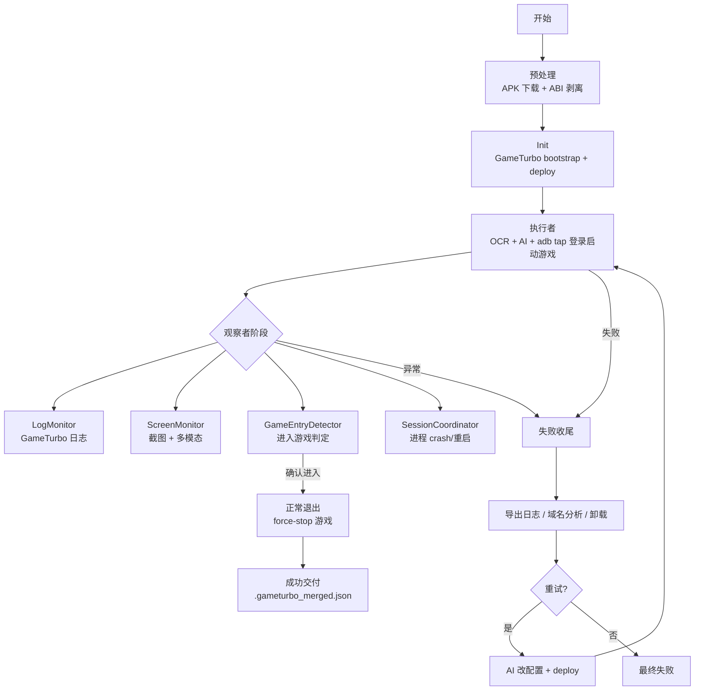

# 整体项目流程图

## 当前架构说明

**执行者阶段**：AI 通过 PaddleOCR 获取画面文字与坐标，调用 `tap_coordinate` / `tap_and_observe`（底层 `adb input tap`）完成登录与启动；检测到 `game.package_name` 进程后进入观察者。

**观察者阶段**：并行监控 GameTurbo 日志、画面异常、是否进入游戏内、游戏进程是否 crash/重启。

**失败与重试**：导出日志与截图 → force-stop 游戏 → 卸载 → AI 分析并修改 `games/*.json` → `deploy.sh` → 从执行者阶段重新跑完整流程。

详见 [README.md](README.md) 与 [skills/game-launch-ocr/SKILL.md](skills/game-launch-ocr/SKILL.md)。
