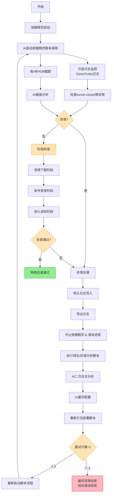

# 整体项目流程图

## 流程图深度解释
目前已经完成了让ai（也就是model，后续统称ai）启动按键精灵，实现让ai正确打开对应的按键精灵脚本并执行。
我们可以假设按键精灵脚本具有下列特性：
1. 按键精灵脚本**是可靠的**且操作流程不会出错，可以**自动完成登录到进入游戏的流程**
2. 按键精灵脚本会执行对游戏画面的全部操作，**无需AI进行干预**

ai在**按键精灵脚本执行的过程中**，将重心切换到检查**网络加速异常情况**

**日志系统**其实就是一套完整的日志写入和导出的流程（要求使用git bash环境）：
- 透过`adb shell "mkdir -p /sdcard/gameturbo"`创建路径，再用`adb shell "logcat -s GameTurbo -d > ~/sdcard/gameturbo/gameturbo.log"`将日志写入到对应文件里
- 用`adb pull`将这个gameturbo.log放到本地，让ai可以进行分析
- 仅当出现了"异常状况"会触发上述日志导出情况，平常就保持对GameTurbo的日志检查（需要分析GameTurbo-Native项目里关于日志什么时候会返回错误情况，比如idle shutdown: no streams for 300s, closing tunnel的出现）
日志导出后再调用本地的`D:\smwl\android-ai-driven-test\GameTurbo-Native\extract_domain_region_from_log.sh`来进行分析

**画面异常检测**就是定时执行screencap指令，让图片下载到一个指定的临时文件夹里，然后导出来给ai进行分析（多模态模型出场），如果画面出现"连接超时"或"当前地区不支持"或是一些别的错误提示，由AI来裁决是否画面有异常情况发生。画面异常有多个阶段需要区分，方便后续错误排查阶段可以根据错误发生的阶段来进行思考，分为三个阶段：下载资源阶段，登陆阶段和进入游戏阶段：
- 下载资源阶段会有一个进度条在下载，定时检查进度条是否有在正常推进（考虑网络问题，给多点时间等待），如果卡在一个地方不动了（几次截图都是同样的进度，就判定该阶段出现问题）
- 登陆阶段判断能不能正常登陆进去，需要检查服务器列表能否正常获取（一般都是没问题的）
- 进入游戏阶段，什么"服务器连接超时"或是"无网络连接"等情况会发生在这里，或是点击了登录没反应（因为ai不会操控画面按钮，所以一个时间段内判断还没进去游戏则问题发生在这里）
发生问题时，这些捕捉到异常的图片都应该被导出到本地。

**画面异常检测**和**日志系统**的关系是并行的，两者会一起检查，一边判断出问题了，就会同时终止掉两边，进行错误排查阶段，ai的分析需要结合两个部分进行思考，所以需要保留图片记录和日志信息。所以本地需要有一个针对每个task而存在的错误检查文件夹存放这些日志和截图，且需要附上重试编号（因为会尝试最多三次，如果修改配置后再次发生错误，需要连同之前的错误记录一起发送给ai，让ai可以全面地整理错误信息，而不是仅针对当前错误）
**需要重点注意**：当检查到异常情况，触发中止的时候，也就是kill_apps流程（杀死按键精灵和游戏进程）后，需要在确保导出了必要文件后，uninstall掉测试的游戏，因为分析完后重新打包会执行delopy.sh, 重新下载一次游戏。要求每一次测试的迭代都是完整的，包含了三个流程

**重试机制**是基于让ai修改了配置后，整体再重新跑一遍一模一样的流程，所以会从最开始的启动按键精灵开始走一遍。