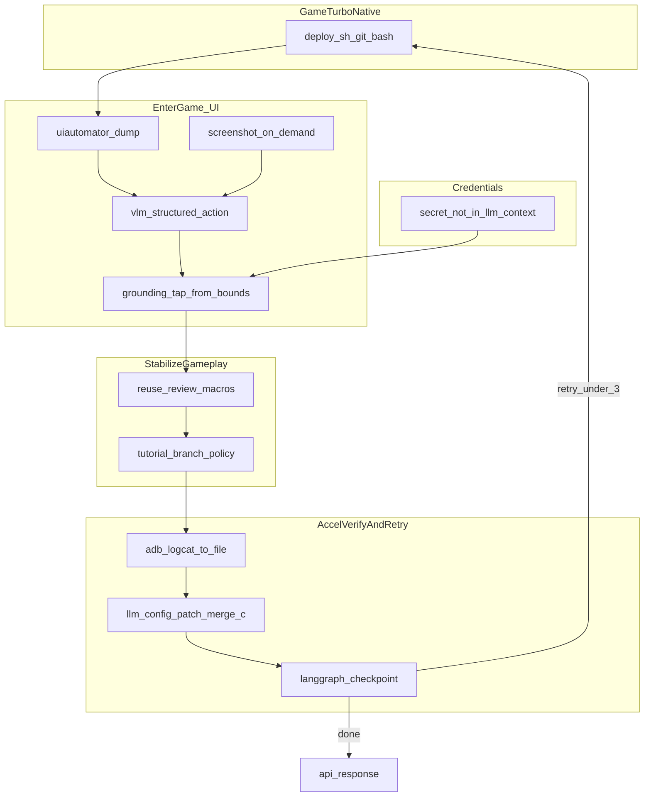

# 网络加速自动化测试：设计方案（含登录与视觉难点）

## 0. 已有流水线与职责边界（GameTurbo-Native）

- 仓库内 **[GameTurbo-Native](d:\smwl\android-ai-driven-test\GameTurbo-Native)** 的 **[client/android/deploy.sh](d:\smwl\android-ai-driven-test\GameTurbo-Native\client\android\deploy.sh)** 已实现 **build → inject → install → launch →（默认可选）logcat monitor** 的一键链路；本地为 **Windows** 时通过 **Git Bash** 执行即可。
- **本方案不重复实现**注入、合并 `games/*.json`、签名安装等步骤；编排层以 **「参数化子进程调用 `deploy.sh`」** 为唯一打包/安装入口（例如 `-g GAME_ID`、`-c` 指定合并后的配置、`-d` 设备、`-n` 跳过脚本自带 tail 等，按运行策略选用）。
- **大模型相关工作的重心**：在「包已在机、进程可观测」之上，设计 **屏幕识别 → 点击执行 → 日志/视觉证据分析 → 配置修改并再次触发 `deploy.sh`** 的闭环与状态持久化，而不是再造一条 Android 构建流水线。

---

## MVP 阶段一：Pydantic-AI 核心验证（启动游戏 + 日志 + 截图 + 操作至登录完成）

**目标**：在**游戏已预装到模拟器**、**不跑 `deploy.sh`** 的前提下，用 **一个 Pydantic-AI Agent**（可先不接 LangGraph 全图）验证：**启动游戏 → 持续可观测 logcat + 截图 → 模型分析 → 下发结构化动作 → 直到进入已登录/主界面**。

**前置条件（由你或 CI 保证）**

- `adb devices` 可见目标模拟器；已知 **`ANDROID_SERIAL`**（或默认单设备）。
- 已知 **`package_name`**；**启动 Activity** 若未知则工具层支持 `monkey -p ... -c ... 1` 或 `cmd package resolve-activity` 解析后 `am start`。
- 可选：**`TEST_CREDENTIALS_PATH`**（账号密码由工具读入，**不进 LLM 明文**）。

**本阶段明确不做**

- 不接入 **配置合并、`deploy.sh`、≤3 轮改配置闭环**。
- 不要求 **向量库 / 完整 LangGraph 四段拆分**（成功后再把本 Agent 嵌进图里即可）。

**工具契约（建议最小集合）**

| 工具 | 职责 |
|------|------|
| `start_game` | `adb shell am start ...` 或等价冷/热启动 |
| `get_logcat_tail` | 最近 N 行或时间窗内 logcat（可按包名/`--pid` 过滤），返回**截断文本**给模型 |
| `capture_screenshot` | `adb exec-out screencap` 落盘；可选降分辨率；路径给多模态或仅作附件 |
| `dump_ui_hierarchy` | `uiautomator dump` 解析为简短可点击节点列表（bounds + text/resource-id） |
| `adb_tap` / `adb_swipe` / `adb_keyevent` | 执行器按模型给出的**结构化坐标或 bounds 中心**点击（校验在屏内） |
| `paste_credential_slot` | `username` / `password` 从文件读入后剪贴板/注入，**工具返回不含密文** |
| （可选）`vlm_screen_kind` | 门禁：dump 不可用或模型不确定时，对**单张**截图调 VLM，输出 `ScreenKind` + 建议动作类型 |

**Agent 循环（可行性核心）**

- **Deps**：`serial`, `package`, `credentials_path`, `max_steps`（如 40）。
- 每轮：模型根据 **上一步工具返回**（log 摘要 + 节点列表 + 可选缩略图描述）选择**下一个工具 + 参数**；执行器执行后把**客观结果**写回（禁止把整段 XML 无截断塞进上下文时可先摘要）。
- **终止条件**：① **成功谓词**（建议配置化：例如 dump 中出现某 `resource-id`/文案、或 logcat 出现某业务「登录成功」TAG——有则用之，无则靠 VLM/人工约定主界面特征）；② **步数用尽**；③ **连续 N 次无进展**（如帧哈希不变且动作重复）熔断。

**与全方案的衔接**

- 本阶段验证通过后，将同一套 **Tools + Agent** 作为 LangGraph 里 **`logging_in` 子图** 的节点实现；再外挂 `invoke_deploy_sh` 与 `PatchConfig`。

---

## AppAgent 参考与游戏专版裁剪

上游项目：[TencentQQGYLab/AppAgent](https://github.com/TencentQQGYLab/AppAgent)（MIT）。其「多模态看屏 + 简化动作空间 + ADB 执行 + 探索/部署两阶段」与我们的目标一致；我们**只服务 Android 游戏**（单包或少量包、登录/进局内为主），因此在**保留思路与可抄代码边界**的前提下做裁剪。

**模块映射（AppAgent → 本仓库建议落点）**

| AppAgent | 作用 | 游戏专版 |
|----------|------|----------|
| [run.py](https://github.com/TencentQQGYLab/AppAgent/blob/main/run.py) → [task_executor.py](https://github.com/TencentQQGYLab/AppAgent/blob/main/scripts/task_executor.py) | 任务循环、调模型、落盘截图/XML | 一个 **Pydantic-AI Agent** + `while`/`for` 步数上限；工具即「一步一工具」 |
| [and_controller.py](https://github.com/TencentQQGYLab/AppAgent/blob/main/scripts/and_controller.py) | `AndroidController`：截屏、uiautomator dump、tap/swipe/back/text | **`game_agent/adb_device.py`**（或同名）：API 尽量对齐（便于对照阅读/少量复制），Windows 下优先 **`adb exec-out screencap`** 拉 PNG，减少 device 内路径与 pull 往返 |
| [model.py](https://github.com/TencentQQGYLab/AppAgent/blob/main/scripts/model.py) | OpenAI/Qwen 多模态请求封装 | **Pydantic-AI** 的 model 设置 + 可选独立 VLM 客户端；结构化输出用 Pydantic 模型约束 |
| [prompts.py](https://github.com/TencentQQGYLab/AppAgent/blob/main/scripts/prompts.py) | 分任务/分阶段的 system 与 user 模板 | **`game_agent/prompts/`** 仅保留：登录、通用弹窗、进主界面；可按 `game_id` 覆写少量行 |
| [learn.py](https://github.com/TencentQQGYLab/AppAgent/blob/main/learn.py) + document_generation / self_explorer | 探索与人类演示、生成元素文档库 | **可选**：不做通用「学 App」；改为 **`games/<id>_hints.yaml`**（人工维护几条「点跳过/同意」）或日后一条「录制宏 JSON」，供 prompt 引用即可 |
| [step_recorder.py](https://github.com/TencentQQGYLab/AppAgent/blob/main/scripts/step_recorder.py) | 记录步骤 | 本仓库用 **artifact 目录**（每 run：`screens/`、`logcat.txt`、`actions.jsonl`） |

**明确不照搬的部分**

- 多 App 交互式 CLI、通用任务描述、完整 benchmark 与文档探索闭环：与「专精游戏 + GameTurbo 流水线」无关，首版砍掉。
- 网格/数字标注的具体实现：可**阅读原文与 LICENSE 后**择要移植到我们的 SoM 工具；若直接复制函数，须在文件头保留 **MIT 版权声明**。

**落地顺序建议**

1. 先实现与 `AndroidController` 等价的 **最小 ADB 封装**（与 MVP 工具表一致）。  
2. 再挂 **Pydantic-AI tools**，最后才把 **AppAgent 式 prompt 段落**（动作 JSON、反思）压缩进登录场景。  
3. 需要对照阅读时，将 AppAgent 以 **git submodule** 或本地克隆到仓库外，避免许可证与依赖树混进 `GameTurbo-Native`。

---

## 重心：大模型编排层（四类能力与推荐拆分）

统一由 **LangGraph** 管阶段与重试，**Pydantic-AI** 管「带 schema 的推理步骤」；每类能力对应**窄接口工具**，避免一个 Agent 混做所有事。

1. **屏幕识别（Recognition）**  
   - **输入**：L1 产出的 `frame_features`（哈希、帧差、模板命中、可选降采样图路径）；门禁触发时的 ROI/全屏 + 可选 SoM 图。  
   - **输出（Pydantic）**：`ScreenKind`、`confidence`、`stuck_hint`；**不直接输出裸坐标** unless 来自 SoM 框号。  
   - **模型**：多模态仅在 L2；常态用本地 CV + 小文本摘要（可选）描述给文本模型。

2. **屏幕点击（Action / Grounding）**  
   - **输入**：上一步结构化意图 + `dump_ui` 结果 + 可选 SoM 映射表。  
   - **输出**：`AdbAction[]`（如 `TapBounds`、`TapSomId`、`Swipe`、`KeyEvent`），由**非 LLM 执行器**调用 `adb shell input *`，保证可审计与可重放。

3. **日志分析（AnalyzeLogs）**  
   - **输入**：`deploy.sh` 运行期落盘或编排层单独 `logcat` 采集的**脱敏片段**（含 gameturbo 等，有则用之）+ **视觉侧摘要**（同一 run 的 L1/L2 结论）。  
   - **输出**：`FailureHypothesis`、`evidence_refs`（文件偏移/时间窗）；供下一步 patch 或人工阅读。

4. **配置修改（PatchConfig + Redeploy）**  
   - **输入**：`FailureHypothesis` + 当前配置 JSON 摘要 + 向量库「已尝试 patch」检索结果。  
   - **输出**：`ConfigPatch`（仅允许白名单键路径）；执行器 **merge → 写临时文件 → `deploy.sh -c <path>`** 进入下一轮，**≤3 次** 与 checkpoint 对齐。

**单 PydanticAI 多 Tool 与上图的关系**：可实现为**一个 Agent 类**挂载 `recognize_screen`、`propose_actions`、`analyze_logs`、`propose_patch`、`invoke_deploy` 等工具，但 **LangGraph 仍用显式节点**包住「调用 deploy 前后」与「人审/熔断」，避免把重试逻辑全塞进 prompt。

---

## 1. 问题拆解（与 [plan.md](d:\smwl\android-ai-driven-test\plan.md) 对齐）

整条链路仍拆成**确定性流水线**与**需要推理的环节**，但你在「可能遇到的困难」里把难点前移到**进游戏之前与新手期**，因此设计必须显式区分阶段，而不是假设「现有脚本已能点到局内」。

建议阶段划分：

- **Build 与观测**：**打包/安装/启动**默认由 **`deploy.sh`** 完成；编排层只负责传参与捕获退出码/日志路径。**观测双轨**仍由编排层补充——**A. 视觉**：`screencap` 采样环（L1）+ 门禁 VLM（L2）。**B. 日志**：脚本自带 monitor 与/或编排层 **`adb logcat`** 按 `log_hints` 额外落盘；**不把业务 log 当 UI 唯一真值**。
- **进游戏前（登录前 UI）**：协议弹窗、更新提示、权限、渠道登录入口等，需要**识别 + 点击**。
- **登录中**：账号/邮箱输入相对容易；**密码**常遇安全键盘/防截屏，不能依赖「截图 + VLM 读密码」。
- **进游戏后（含新手引导）**：需到达可观测「加速效果」的稳定局内或指定场景；强制教程要**可重复、可中止或可走最短路径**。
- **加速验证与失败闭环**：综合 **视觉停滞/断连** 与 **gameturbo 等（若存在）**；LLM 产出 **ConfigPatch** 后经 **merge 写文件 → `deploy.sh -c`** 重跑，最多 3 轮。

---

## 2. 核心设计决策：「截图与坐标」不要绑死在纯 VLM 上

你在 plan 里提出的关键问题：**即使有截图，LLM 如何拿到画面坐标并正确操作？截图是定时器还是由 LLM 调工具触发？**

推荐结论（在「跨游戏、日志不可控」前提下折中）：

- **真值分层**：**UI/当前画面属于哪一类、是否卡住、是否完成加载**，以 **`adb screencap` 像素证据链** 为**跨游戏最稳的公共分母**（游戏可以不写业务 log）。**`adb logcat` 不当作 UI 态唯一依据**：TAG 因包而异、厂商裁剪、发布版关 log 都会导致**漏判/误判**；日志更适合 **gameturbo/加速器与网络侧** 及「**有则用之**」的辅助线索，写入**每游戏可选 `log_hints` 配置**，缺失时降级为纯视觉 + 加速器日志。
- **点击落点（仍省模型）**：在 **dump 可用** 时继续 **优先 bounds + `input tap`**（与「画面真值」解耦：dump 帮助找框，**不假设** dump 能反映全部游戏 UI 状态）。
- **辅语义源**：需要「这是登录还是更新弹窗」等**语义分类**时，用 **VLM +（可选）SoM**；输入来自**门禁后的截图**，而非每帧。
- **坐标落地（简约、原生优先）**：dump bounds → `adb shell input tap/swipe`；无节点则 **SoM + VLM 选框** → `input tap`；再不行 **`screencap` + OpenCV 模板**（仍全 adb 生态）。
- **截图节奏与 token（与「视觉为真值」不矛盾）**：**稳定 ≠ 每帧送多模态**。做法是建立 **`screencap` 采样环（本地、廉价）**：固定或自适应间隔抓帧 → **降采样 + 感知哈希/帧差 + 模板** 在**本机**判断「是否长期无变化 / 是否匹配已知加载图」——**全程不进 VLM**。仅当 **(a) 本地判据进入 unknown / stuck**，或 **(b) 需要产出可点击语义** 时，才取**当前一帧（或 ROI）**送 **VLM/SoM**；并保留 **冷却、同哈希去重、降分辨率**。
- **定时器**：允许比纯 log 方案**更密的 screencap 心跳**，只要**不默认绑定「每次心跳都调用 VLM」**；心跳成本主要是 **IO 与本地 CV**，可控。

这样「主脑 model 独立完成分析、执行、判断、输出」仍可成立，但**执行**应通过**受控工具**完成：模型输出的是**结构化动作**（例如 `TapNode(selector)`、`Back`、`WaitFor(text)`），而不是自由手写像素脚本。

### 2.1 实时运行态下「谁在感知」小结（修正版）

- **L0（可选、非 UI 真值）**：`adb logcat` 中**已配置且存在**的 gameturbo/网络线索；进程存活。用于**加速诊断**与辅助，不作为「当前第几屏」的唯一来源。
- **L1（主链、不进 VLM）**：**`screencap` 像素流** + 本地 **帧哈希/帧差、OpenCV 模板、简单 ROI 统计**；负责**跨游戏**的「是否在转」「是否画面冻结」「是否离开加载图」等**可迁移判据**。
- **L2（进 VLM，低频）**：L1 报 unknown/stuck 或需要**语义分屏/选 SoM 框**时，**单次**截图（可 ROI/降采样/SoM），带冷却与去重。

---

## 3. 分层应对你在 plan 里列的三类困难

**（1）登录前：弹窗与杂项**

- 用 **无障碍树 + 关键字 / id 规则** 处理高频弹窗（同意、关闭、跳过）；可维护小型 **弹窗黑名单/白名单**（外部建议里的「未知 UI 库」的轻量版）。覆盖不到的交给 **VLM 分类当前屏类型**，再由 Grounding 在树上找「最像关闭/同意」的节点；树不可用时走 **SoM 选框** 或兜底滑动。
- 与「网络加速」主目标解耦：这一阶段的状态机应单独可测（mock 包或测试服）。

**（2）登录时：账号可输、密码防截屏（含「测试账号文件」方案）**

- **需求对齐**：你将**账号与密码放在同一测试账号文件**（本地、不入库）。需要 LLM 在登录流程中**可靠完成「填入账号栏 + 填入密码栏」**。
- **关键约束（强烈建议写进实现规范）**：**不要让模型读取或复述文件中的明文密码**。做法是：Agent 只输出**结构化步骤**（例如 `FocusField(account)` → `PasteFromCredentialFile(slot=username)` → `FocusField(password)` → `PasteFromCredentialFile(slot=password)` → `Tap(login)`）；**执行器（Python Tool）**在运行时读取该文件，把对应片段写入**设备剪贴板**或通过 **Accessibility / `adb` 文本注入** 粘贴到已聚焦的输入框。这样 LLM 做的是**决策与定位**，**复制粘贴的载荷由执行器完成**，避免密文进入 prompt、trace 与多模态截图链。
- **账号/邮箱**：与密码同文件时，仍走「执行器读文件 → 剪贴板/`adb` 注入」；若某 ROM 剪贴板权限受限，再降级 **`adb shell input text`**（注意字符集与焦点）。**不默认依赖第三方输入法脚本**。
- **密码**：不要走「截图→VLM 识别密文」。**对照 Gemini 的 adb/剪贴板/无障碍**：`adb shell input text` 在 **特殊字符、多语言、安全键盘** 上常不可靠，仅作**剪贴板粘贴失败后的降级**；剪贴板广播若需小助手 APK 则纳入部署清单；无障碍向 `EditText` 注入在部分游戏上可行但仍可能受限。**若文件内为真实测试密文**，仍以执行器注入为主，并保留 **一键登录 token / 测试包** 作为更省事的分支。对外触发若需多账号，可用 `account_profile_id` 选文件内条目，**不把密码字段写进 API body**。
- **文件约定（实现时定稿）**：路径由配置项指定（如 `TEST_CREDENTIALS_PATH`），**加入 `.gitignore`**；格式可用 JSON/YAML（`username`/`password` 或多 profile）；执行器校验编码与长度，失败则向 Agent 返回**不含密文**的错误码。

**（3）登录后：进局内与新手引导**

- **第一优先**：**现有交易审核脚本**若已能驱动流程则复用；**新增与补缺操作以 ADB 命令序列为主**（与 `adb logcat` 同一 toolchain），避免再引入**按键精灵等第三方闭源操控**作为默认依赖。
- **第二优先**：VLM + dump/SoM 做**分支检测**（是否仍在教程、是否卡加载），输出**有限集合的 ADB 级微步骤**（如固定坐标连点跳过、等待超时），必须带**全局步数上限**与**失败回滚**。
- 「自行进行游戏操作」若与加速验证无强相关，应定义**最小可观测里程碑**（例如进入主城 + 发起一次可产生网络日志的操作），避免无限「玩下去」。

---

## 4. 主控角色：单编排图 + 多「能力子图」

仍建议 **LangGraph 单一状态机** 为主控，避免多 Agent 会话互传；但图中可挂载多个子能力：

- **VisionUI 子图**（Pydantic-AI agent）：**UI 态与异常**以 **L1 视觉特征 + 门禁后截图** 为主输入；log 片段仅作辅；输出 `ScreenKind` + `StructuredAction[]`（Pydantic）。
- **NetDiag 子图**：**logcat 落盘文件**中 gameturbo/相关 TAG 的摘要 + `ConfigPatch`（Pydantic）。
- **Memory**：向量库记录「屏型 + 已尝试动作序列指纹 + 配置指纹」，防止在同类弹窗上死循环点同一个无效区域。

**与「单 PydanticAI + 多 Tool」的折中（对齐 Gemini）**：实现上可以是一个 **PydanticAI Agent**（Deps 注入配置、重试计数、向量库客户端），下面挂 `capture_screen`、`dump_ui`、`vlm_pick_som_box`、**`paste_credential_slot`（读测试账号文件，不回显密文）**、**`long_press_paste` / `clear_field`**、`apply_config_patch`、**`snapshot_logcat` / `start_logcat_session`**、**`invoke_deploy_sh`（Git Bash + [deploy.sh](d:\smwl\android-ai-driven-test\GameTurbo-Native\client\android\deploy.sh)）** 等工具；**LangGraph 只负责阶段转移、重试边界与 checkpoint**，不把业务逻辑拆成多个会话的 Agent。**感知仍建议独立 VLM 调用**（工具内部调多模态 API），避免一个文本模型硬扛图像。

「主脑必须能独立完成」可落实为：**同一 run 内同一状态对象**串联各节点；**不拆成互相聊天的多个主 Agent**。

**唤醒策略（Gemini）**：脚本/规则主跑 → 超时或模板失败 → **按需截图 + 唤醒** UI/诊断分支，与上文「按需截图为主」一致。

---

## 5. 技术框架组合（与前一版一致处略写）

- **LangGraph**：checkpoint 保存阶段（`pre_login`、`logging_in`、`onboarding`、`in_game_probe`、`net_tune_retry`）、重试计数、每轮 artifact 路径。
- **Pydantic-AI**：所有 LLM 边界强制 schema；**配置 patch 与 UI 动作**分不同 model 或不同 toolset，降低串台。
- **Vector DB**：embedding 建议用「屏型摘要 + 失败原因标签 + 配置 hash」短文本，而非整屏像素级描述长文。
- **Android 日志采集（手游主场景）**：统一走 **`adb logcat`**（子进程持续读或分轮 `timeout` 快照均可）。建议：用 **`--pid=<游戏进程>`** 或 **包名过滤** 降噪；为 `gameturbo`、Unity/UE 常用 TAG、网络库 TAG 维护**可配置 filter 列表**；每轮尝试输出独立 **log 文件路径** 供失败报告与 LLM 工具读取；必要时与 `adb bugreport` 分档（重操作，仅末次失败开启）。

---

## 6. 端到端数据流（修订）

---

## 7. 风险与对策（增补）

1. **纯 VLM 坐标漂移**：用树 bounds 为主、SoM/模板为辅；对 VLM 输出做**范围校验**（点击点须在屏内；SoM 仅接受**后端生成的合法框号**）。
2. **密码与合规**：凭据永不进模型上下文；**测试账号文件**仅被执行器进程读取，**禁止**在 tool 返回值、LangSmith/日志采集、截图里带出明文；审计日志打码。
3. **新手引导无限循环**：步数上限 + 向量记忆判「重复无效动作序列」+ 人工 escalation 钩子。
4. **WebView 登录**：无障碍树弱时，用 **`adb screencap` + OpenCV ROI** 做模板兜底，模板资产版本化；仍优先不引入非 adb 操控栈。
5. **转圈/重连误判**：**以视觉 L1（模板/帧差）为主**；log 中 gameturbo/网络线索**有则用**，无则**不强行依赖**；可辅以简单流量观测。
6. **操控栈（简约版）**：**默认仅 ADB +（可选）uiautomator2 等仍走 adb 生态的开源封装**；主机侧 **PyAutoGUI** 仅保留为「模拟器系统 UI 且 adb 无法命中」的**极少数补充**，首版可不实现。**不将按键精灵纳入默认架构**。**日志**仍为 **`adb logcat` 落盘**；单机无需 **ELK**。
7. **「内核/SendInput 级」输入**：对**部分 Windows 模拟器**焦点窗可能有效，但对**真机无效**且引入安全与维护成本，**不作为默认方案**，仅在明确只跑指定模拟器且合规批准时评估。
8. **VLM 成本失控**：若出现「while true 截图问模型」即视为反模式；用门禁、冷却、帧哈希去重与 ROI/降分辨率约束单次调用。

---

## 8. 建议落地顺序（按依赖重排）

0. **（当前优先）Pydantic-AI 登录 MVP**：见上文 **「MVP 阶段一」**——单 Agent + 启动/logcat/截图/dump/tap/凭据工具，预装游戏跑通登录；**先于** `invoke_deploy_sh` 全链路。

1. **`invoke_deploy_sh` 封装**：从编排进程调用 **Git Bash** 执行 `deploy.sh`（工作目录、参数、超时、stdout/stderr 落盘）；与 **L1 screencap 环**并行或串行策略定稿。
2. **Grounding 与视觉门禁**：dump → `tap`；`screencap` 心跳 + 哈希/模板；SoM+VLM 仅在门禁触发。
3. **凭据与登录 UI**：`TEST_CREDENTIALS_PATH` + `paste_credential_slot` 等；与 dump/SoM 联调。
4. **四段 LangGraph 节点**：RecognizeScreen / ActOnDevice / AnalyzeLogs / PatchAndRedeploy（patch 后 **merge JSON → `deploy.sh -c`**）；checkpoint + 向量记忆 + ≤3 轮。
5. **对外 API** 与 artifact 规范。

**存量说明**：若现有审核脚本曾依赖按键精灵，可短期以外挂方式保留，但**核心编排与缺口填补以 adb 为主路径**，后续再迁移，避免双栈长期并行。

---
## 9. 与 Gemini 建议的对照（结论摘要）

- **高度一致、已写入上文**：事件驱动/FSM；按需截图；混合视觉（dump 优先，游戏弱树则 VLM）；SoM 降低坐标幻觉；OpenCV 处理转圈等动态图标；脚本主线加异常唤醒 Agent；单主控加多 Tool（不搞多 Agent 互聊）；向量库防配置死循环；gameturbo 与流量或日志辅助判连接失败。
- **采纳但加了前提**：adb input text、剪贴板、无障碍作为降级链，仍以测试凭据体系为主；**PyAutoGUI 首版可不做**；ELK、SendInput 类方案降级或延后。
